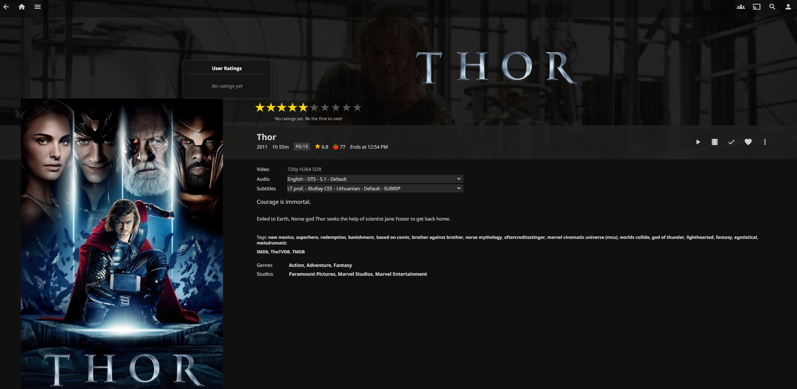
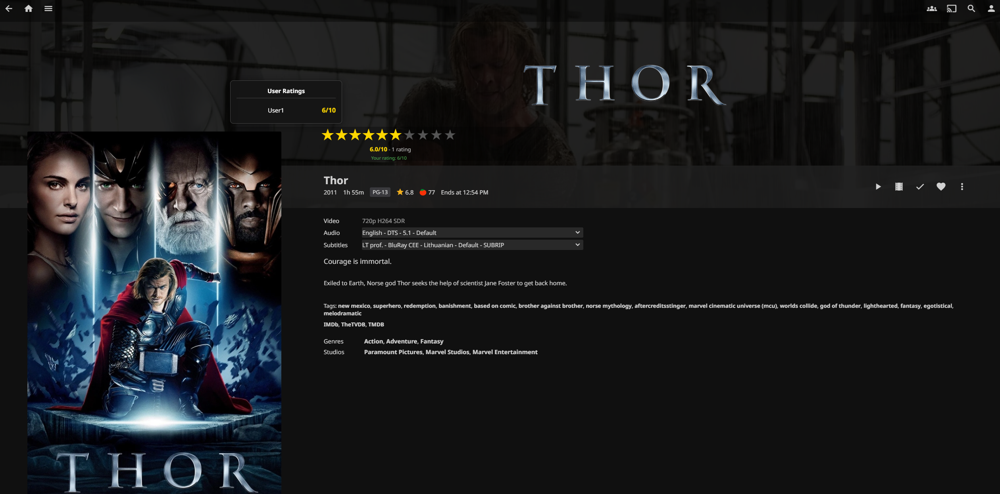
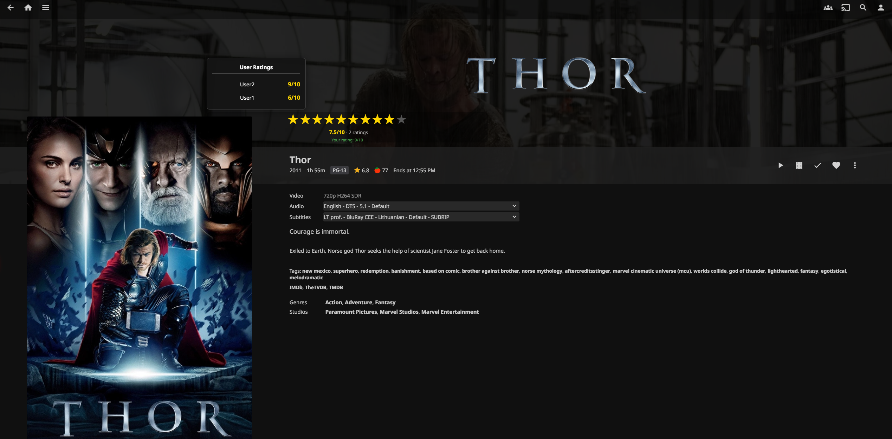
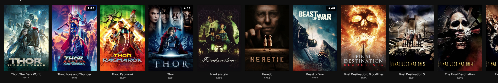

# Jellyfin Ratings Plugin

A professional, feature-rich rating system for Jellyfin media server with performance-optimized card overlays designed for large media libraries.

## Screenshots

### Rating Detail Page

*Interactive 1-10 star rating system displayed below the movie title*

### User Ratings Popup

*Hover over stars to see detailed ratings from all users*

### Rated Media

*Your rating is saved and displayed with highlighted stars*

### Card Overlays

*Rating badges automatically appear on media thumbnails throughout Jellyfin*

## Features

### ⭐ Star Rating System
- **1-10 star rating** for all media types (movies, TV shows, music, etc.)
- **Interactive UI** with smooth hover effects and instant feedback
- **Visual indicators** showing your rating and average community rating
- **Persistent ratings** saved per-user across all devices

### 👥 User Ratings Display
- **Hover popup** showing detailed ratings from all users
- **Username display** with individual ratings (e.g., "John: 8/10")
- **Rating statistics** including average rating and total number of ratings
- **Privacy-aware** - only shows ratings, not full user profiles

### 🎯 Media Card Overlays
- **Rating badges** displayed on media cards (e.g., "★ 7.5")
- **Lazy loading** using IntersectionObserver for optimal performance
- **Smart caching** prevents duplicate API requests
- **Optimized for large libraries** (tested with 15TB+ media collections)
- **Non-intrusive design** that doesn't interfere with Jellyfin's UI

### 🚀 Performance Optimized
- **IntersectionObserver** loads ratings only for visible cards
- **Request caching** eliminates duplicate API calls
- **Efficient DOM handling** prevents UI lag
- **Minimal server load** even with thousands of media items

## Installation

1. **Add Plugin Repository**
   - Go to Jellyfin Dashboard → Plugins → Repositories
   - Add repository URL: `https://raw.githubusercontent.com/K3ntas/jellyfin-plugin-ratings/main/manifest.json`

2. **Install Plugin**
   - Go to Plugins → Catalog
   - Find "Ratings" and click Install
   - Restart Jellyfin server

3. **Automatic Setup**
   - Plugin automatically injects rating UI on detail pages
   - No manual configuration required
   - Works immediately after server restart

## Usage

### Rating Media
1. Open any movie, TV show, or media item
2. Find the rating stars below the title/logo
3. Click a star (1-10) to submit your rating
4. Your rating is saved immediately

### Viewing Ratings
- **Your rating**: Displayed with highlighted stars
- **Average rating**: Shown as "X.X/10" with total count
- **All user ratings**: Hover over stars to see detailed popup
- **Card badges**: Rating badges appear on media thumbnails automatically

## Technical Details

### Requirements
- **Jellyfin**: 10.11.0 or higher
- **.NET**: 9.0
- **Browser**: Modern browser with JavaScript enabled

### Architecture
- **Backend**: ASP.NET Core controller with RESTful API
- **Frontend**: Vanilla JavaScript (no dependencies)
- **Storage**: JSON-based file storage in plugin data directory
- **Authentication**: Jellyfin's built-in authentication system

### API Endpoints
- `POST /Ratings/Items/{itemId}/Rating?rating={1-10}` - Submit rating
- `GET /Ratings/Items/{itemId}/Stats` - Get rating statistics
- `GET /Ratings/Items/{itemId}/DetailedRatings` - Get all user ratings
- `DELETE /Ratings/Items/{itemId}/Rating` - Delete your rating
- `GET /Ratings/User/{userId}/Rating?itemId={itemId}` - Get specific user rating

### Performance Characteristics
- **Initial load**: ~2 seconds delay for page stability
- **Per-card overhead**: Single cached API request per unique item
- **Memory usage**: Minimal (~1MB for 1000 cached ratings)
- **Server load**: Negligible (lazy loading prevents request storms)

## Development

### Building from Source
```bash
git clone https://github.com/K3ntas/jellyfin-plugin-ratings.git
cd jellyfin-plugin-ratings
dotnet build -c Release
```

### Project Structure
```
├── Api/                    # API controllers
│   └── RatingsController.cs
├── Data/                   # Data layer
│   └── RatingsRepository.cs
├── Models/                 # Data models
├── Web/                    # Frontend assets
│   └── ratings.js         # Main client-side script
├── Configuration/          # Plugin config pages
└── manifest.json          # Plugin catalog manifest
```

## License

Licensed under the MIT License. See [LICENSE](LICENSE) file for details.

## Support

**Issues**: https://github.com/K3ntas/jellyfin-plugin-ratings/issues

## Version History

### 1.0.53.0 (Current)
- Fixed plugin loading delay on detail pages
- Improved element detection speed (3 seconds → 100ms intervals)
- Faster rating UI injection when navigating to media items
- Added professional screenshots to README documentation

### 1.0.52.0
- HOTFIX: Improved folder card detection using data-isfolder attribute
- Enhanced hash-based routing pattern detection (#/list, #/tv?, #/movies?)
- Added URL parameter filtering (topParentId, parentId)
- Rating overlays now properly excluded from all library folders

### 1.0.51.0
- Fixed rating badges appearing on library folder cards
- Rating overlays now only display on actual media items
- Improved card filtering to differentiate folders from media content

### 1.0.50.0
- Production release with optimized card overlays
- Fixed image loading issues
- Maintains lazy loading performance for large libraries

## Contributing

This is a personal project created for the Jellyfin community. While not actively seeking contributions, bug reports and feature requests are welcome via GitHub Issues.

## Acknowledgments

Built for the Jellyfin community with ❤️

Special thanks to the Jellyfin team for creating an amazing open-source media server platform.
