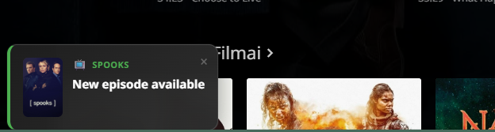
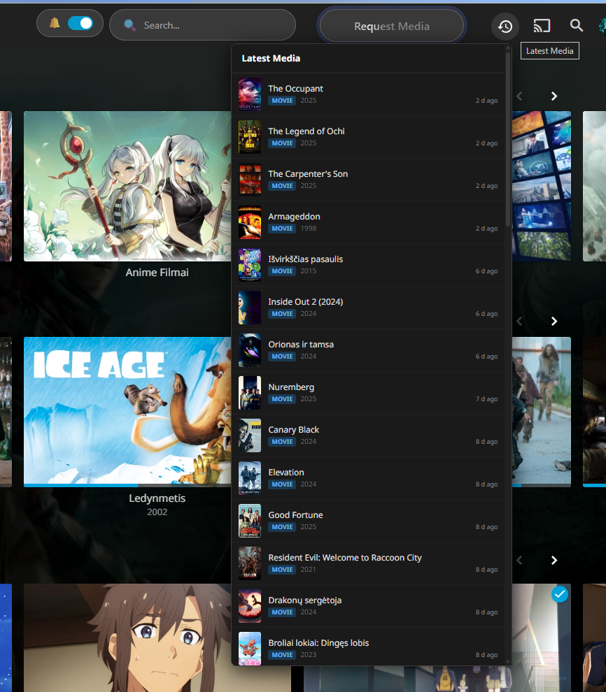
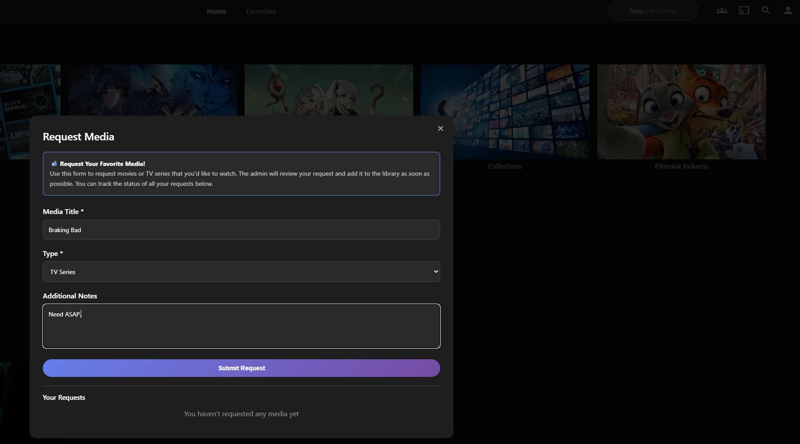
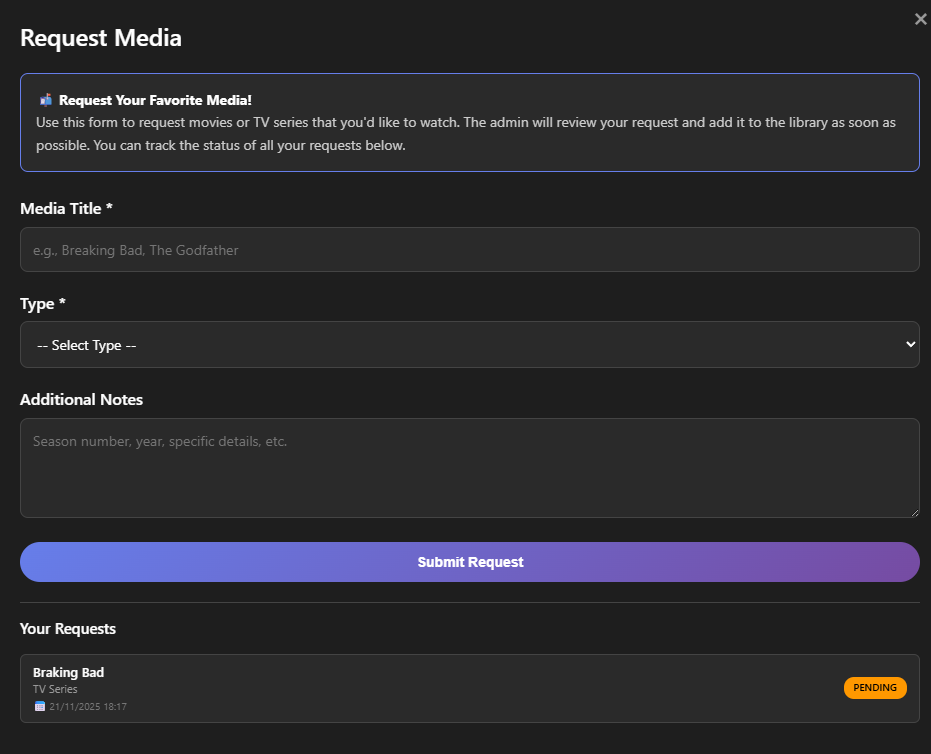
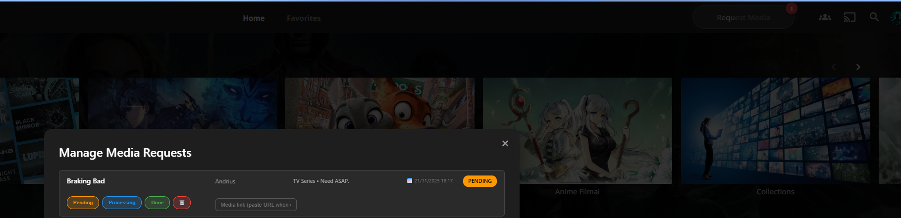
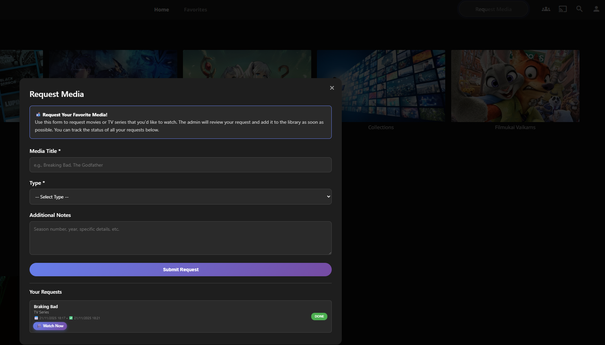

# Jellyfin Ratings Plugin

A professional, feature-rich rating system for Jellyfin media server with performance-optimized card overlays, a built-in media request system, and real-time new media notifications.

**Issues & Support**: https://github.com/K3ntas/jellyfin-plugin-ratings/issues

---

## Screenshots

### Rating Detail Page

*Interactive 1-10 star rating system displayed below the movie title*

### User Ratings Popup

*Hover over stars to see detailed ratings from all users*

### Rated Media

*Your rating is saved and displayed with highlighted stars*

### Card Overlays

*Rating badges automatically appear on media thumbnails throughout Jellyfin*

### Netflix-Style View

*Optional Netflix-style view with horizontal genre rows and smooth scrolling*

### New Media Notifications

*Real-time notifications when new movies or episodes are added to your library*

### Latest Media Button

*Quick access to your 50 most recently added movies and series with time-ago indicators*

---

> **Note:** All features are optional and can be enabled/disabled through the plugin settings in the Jellyfin Dashboard.

---

## Media Request System

The plugin includes a complete media request system that allows users to request movies and TV series from administrators.

### Request Media Button

*Sleek "Request Media" button with animated shine effect in the Jellyfin header*

### User Request Form

*Users can submit requests with title, type (Movie/TV Series/Anime), and additional notes*

### User Request List with Status

*Users can track all their requests with timestamps and current status (Pending/Processing/Done)*

### Admin Notification Badge

*Admins see a red notification badge showing the number of pending requests*

### Admin Request Management

*Admins can view all requests with user info, timestamps, and change status with one click*

### Completed Request with Watch Now

*When a request is fulfilled, users see a "Watch Now" button linking directly to the media*

---

## Features

### Star Rating System
- **1-10 star rating** for all media types (movies, TV shows, music, etc.)
- **Interactive UI** with smooth hover effects and instant feedback
- **Visual indicators** showing your rating and average community rating
- **Persistent ratings** saved per-user across all devices

### User Ratings Display
- **Hover popup** showing detailed ratings from all users
- **Username display** with individual ratings (e.g., "John: 8/10")
- **Rating statistics** including average rating and total number of ratings
- **Privacy-aware** - only shows ratings, not full user profiles

### Media Card Overlays
- **Rating badges** displayed on media cards (e.g., "7.5")
- **Lazy loading** using IntersectionObserver for optimal performance
- **Smart caching** prevents duplicate API requests
- **Optimized for large libraries** (tested with 15TB+ media collections)
- **Non-intrusive design** that doesn't interfere with Jellyfin's UI

### New Media Notifications
- **Real-time notifications** when new movies, series, or episodes are added
- **Beautiful popup UI** with media poster, title, and year
- **Episode grouping** - multiple episodes show as single notification (e.g., "Episodes 4-8")
- **Smart timing** - 2-10 minute random delay between notifications to avoid spam
- **24-hour duplicate prevention** - same item won't notify twice
- **Toggle control** - users can enable/disable notifications via header toggle
- **Works during playback** - notifications appear even in fullscreen mode
- **Fire TV/Android TV support** - native app notifications via DisplayMessage

### Latest Media Button
- **Replaces Sync Play** - button in header shows your 50 most recently added media
- **Compact dropdown** - scrollable list with thumbnail, title, year, and type badge
- **Type badges** - Movie (blue), Series (green), Anime (purple), Other (gray)
- **Time-ago indicator** - shows when media was added (e.g., "5 min ago", "2 d ago")
- **Clean titles** - automatically removes IMDB IDs from display
- **Click to navigate** - go directly to media detail page
- **Responsive design** - inherits Jellyfin's native header button behavior
- **Configurable** - can be disabled in plugin settings

### Media Request System
- **Request Button** - Animated "Request Media" button in the header
- **User Features**:
  - Submit requests for Movies, TV Series, or Anime
  - Add notes (e.g., "Season 2", "Need ASAP")
  - Track request status (Pending → Processing → Done)
  - See timestamps for when requested and completed
  - "Watch Now" button when request is fulfilled with link
  - Multi-language support (EN/LT)
- **Admin Features**:
  - Notification badge showing pending request count
  - View all requests with user info and notes
  - One-click status updates (Pending/Processing/Done)
  - Add media link when marking as Done
  - Delete requests permanently
  - See request and completion timestamps
- **Mobile Responsive** - Card layout and dropdown selector on mobile devices
- **Multi-user Support** - Cache clears on logout/account switch

### Performance Optimized
- **IntersectionObserver** loads ratings only for visible cards
- **Request caching** eliminates duplicate API calls
- **Efficient DOM handling** prevents UI lag
- **Minimal server load** even with thousands of media items
- **Silent logging** - server only logs errors, not routine operations

---

## Installation

1. **Add Plugin Repository**
   - Go to Jellyfin Dashboard → Plugins → Repositories
   - Add repository URL: `https://raw.githubusercontent.com/K3ntas/jellyfin-plugin-ratings/main/manifest.json`

2. **Install Plugin**
   - Go to Plugins → Catalog
   - Find "Ratings" and click Install
   - Restart Jellyfin server

3. **Automatic Setup**
   - Plugin automatically injects rating UI on detail pages
   - Request Media button appears in the header
   - Notification toggle appears near the search field
   - No manual configuration required
   - Works immediately after server restart

---

## Usage

### Rating Media
1. Open any movie, TV show, or media item
2. Find the rating stars below the title/logo
3. Click a star (1-10) to submit your rating
4. Your rating is saved immediately

### Viewing Ratings
- **Your rating**: Displayed with highlighted stars
- **Average rating**: Shown as "X.X/10" with total count
- **All user ratings**: Hover over stars to see detailed popup
- **Card badges**: Rating badges appear on media thumbnails automatically

### New Media Notifications
- Notifications appear automatically when new content is added
- Use the toggle switch in the header to enable/disable notifications
- Episode notifications show series name with season (e.g., "SPOOKS S01 - Episodes 4-8")
- Click notification to navigate to the media item

### Requesting Media (Users)
1. Click the "Request Media" button in the header
2. Fill in the media title (required)
3. Select the type (Movie, TV Series, Anime, etc.)
4. Add any additional notes (season number, year, etc.)
5. Click "Submit Request"
6. Track your requests in the "Your Requests" section

### Managing Requests (Admins)
1. Click the "Request Media" button (shows pending count)
2. View all user requests with details
3. Update status: Pending → Processing → Done
4. When marking as Done, paste the media URL first
5. Users will see a "Watch Now" button linking to the media
6. Delete requests using the trash button

---

## Technical Details

### Requirements
- **Jellyfin**: 10.11.0 or higher
- **.NET**: 9.0
- **Browser**: Modern browser with JavaScript enabled

### Architecture
- **Backend**: ASP.NET Core controller with RESTful API
- **Frontend**: Vanilla JavaScript (no dependencies)
- **Storage**: JSON-based file storage in plugin data directory
- **Authentication**: Jellyfin's built-in authentication system
- **Notifications**: Library event subscription with queue-based delivery

### API Endpoints

#### Ratings
- `POST /Ratings/Items/{itemId}/Rating?rating={1-10}` - Submit rating
- `GET /Ratings/Items/{itemId}/Stats` - Get rating statistics
- `GET /Ratings/Items/{itemId}/DetailedRatings` - Get all user ratings
- `DELETE /Ratings/Items/{itemId}/Rating` - Delete your rating

#### Notifications
- `GET /Ratings/Notifications?since={ISO8601}` - Get notifications since timestamp
- `POST /Ratings/Notifications/Test` - Send test notification (admin only)
- `GET /Ratings/Config` - Get plugin configuration

#### Media Requests
- `POST /Ratings/Requests` - Create new request
- `GET /Ratings/Requests` - Get all requests
- `POST /Ratings/Requests/{requestId}/Status?status={status}&mediaLink={url}` - Update status
- `DELETE /Ratings/Requests/{requestId}` - Delete request

### Performance Characteristics
- **Initial load**: ~1.5 seconds delay for page stability
- **Per-card overhead**: Single cached API request per unique item
- **Memory usage**: Minimal (~1MB for 1000 cached ratings)
- **Server load**: Negligible (lazy loading prevents request storms)
- **Notification polling**: 10-second intervals, silent operation

---

## Development

### Building from Source
```bash
git clone https://github.com/K3ntas/jellyfin-plugin-ratings.git
cd jellyfin-plugin-ratings
dotnet build -c Release
```

### Project Structure
```
├── Api/                    # API controllers
│   └── RatingsController.cs
├── Data/                   # Data layer
│   └── RatingsRepository.cs
├── Models/                 # Data models
│   ├── Rating.cs
│   ├── MediaRequest.cs
│   └── NewMediaNotification.cs
├── Web/                    # Frontend assets
│   └── ratings.js         # Main client-side script
├── Configuration/          # Plugin config pages
├── images/                 # README screenshots
├── NotificationService.cs  # Library event handler
└── manifest.json          # Plugin catalog manifest
```

---

## License

Licensed under the MIT License. See [LICENSE](LICENSE) file for details.

---

## Version History

### 1.0.194.0 (Current)
- **Media button now in header** - replaces Jellyfin's original search button (admin only)
- Responsive design matches other header buttons
- Folder icon for easy recognition

### 1.0.193.0
- Fixed Media button injection - now properly finds and injects into Jellyfin's mainDrawer sidebar

### 1.0.192.0
- **Media button moved to Dashboard sidebar** - appears in Server section when viewing admin Dashboard
- More intuitive location for admin features

### 1.0.191.0
- **Admin Media Management**: New "Media" button in header for admins
- Full library view with stats (title, year, rating, file size)
- Search, filter by type, and sort by multiple fields
- **Scheduled Deletion**: Schedule media to be deleted after X days
- **"Leaving in X days" badges**: Visible to ALL users on cards and detail pages
- Auto-delete via background service (checks hourly)
- Admin can cancel scheduled deletions
- Multi-language support (EN/LT)

### 1.0.190.0
- Latest Media: Removed IMDB IDs from titles (e.g., `[imdbid-tt1234567]`)
- Latest Media: Added "time ago" indicator showing when media was added
- Latest Media: Fixed header background to be solid (not transparent)

### 1.0.189.0
- Added Latest Media button that replaces Sync Play button in header
- Shows dropdown with 50 most recently added movies and series
- Compact list with thumbnail, title, year, and type badge (Movie/Series/Anime)
- Configurable via plugin settings (enabled by default)
- Inherits Jellyfin's native header button responsive behavior

### 1.0.171.0
- Completely silent logging - no notification polling logs at all
- Server only logs errors now

### 1.0.170.0
- Reduced server logging - notification polling no longer floods logs
- Removed verbose startup/shutdown banners

### 1.0.169.0
- Fixed notification toggle hover tooltip

### 1.0.168.0
- Language translation (EN/LT) for request modal

### 1.0.167.0
- Improved notification queue: 2-10 min random delay, 24-hour duplicate prevention

### 1.0.165.0
- Added 470px breakpoint for very small screens

### 1.0.164.0
- Added 590px breakpoint for smaller screens

### 1.0.163.0
- Mobile toggle positioning improvements

### 1.0.160.0 - 1.0.162.0
- Notification toggle moved left of search field with hover tooltip

### 1.0.158.0 - 1.0.159.0
- Added notification toggle slider in header

### 1.0.153.0 - 1.0.157.0
- Episode notifications with season number, settings for notifications

### 1.0.152.0
- Episode grouping: multiple episodes as single notification

### 1.0.151.0
- Fix browser real-time notifications timing

### 1.0.150.0
- Listen to both ItemAdded and ItemUpdated events

### 1.0.134.0 - 1.0.149.0
- New media notifications system with popup UI

---

## Contributing

Bug reports and feature requests are welcome via GitHub Issues.

## Acknowledgments

Built for the Jellyfin community. Special thanks to the Jellyfin team for creating an amazing open-source media server platform.
