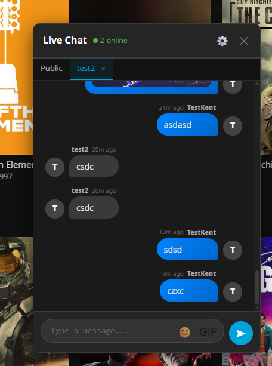
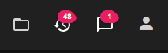
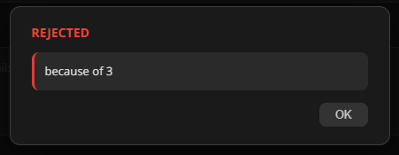
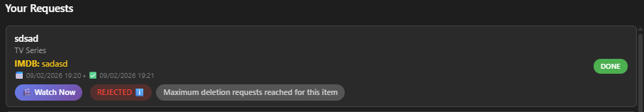

# Jellyfin Ratings Plugin

A professional, feature-rich rating system for Jellyfin media server with performance-optimized card overlays, a built-in media request system, deletion request workflow, user ban management, and real-time new media notifications.

**Issues & Support**: https://github.com/K3ntas/jellyfin-plugin-ratings/issues

---

## Screenshots

### Rating Detail Page

*Interactive 1-10 star rating system displayed below the movie title*

### User Ratings Popup

*Hover over stars to see detailed ratings from all users*

### Rated Media

*Your rating is saved and displayed with highlighted stars*

### Card Overlays

*Rating badges automatically appear on media thumbnails throughout Jellyfin*

### Netflix-Style View

*Optional Netflix-style view with horizontal genre rows and smooth scrolling*

### New Media Notifications

*Real-time notifications when new movies or episodes are added to your library*

### Latest Media Button

*Quick access to your 50 most recently added movies and series with time-ago indicators*

### Live Chat System

*Real-time public chat with Messenger-style bubbles, emoji support, and GIF integration*

### Private Messages & Notifications

*Private messaging with notification badges showing unread conversation count*

---

> **Note:** All features are optional and can be enabled/disabled through the plugin settings in the Jellyfin Dashboard.

---

## Media Request System

The plugin includes a complete media request system that allows users to request movies and TV series from administrators.

### Request Media Button

*Sleek "Request Media" button with animated shine effect in the Jellyfin header*

### User Request Form

*Users can submit requests with title, type (Movie/TV Series/Anime), and additional notes*

### User Request List with Status

*Users can track all their requests with timestamps and current status (Pending/Processing/Done)*

### Admin Notification Badge

*Admins see a red notification badge showing the number of pending requests*

### Admin Request Management

*Admins can view all requests with user info, timestamps, and change status with one click*

### Completed Request with Watch Now

*When a request is fulfilled, users see a "Watch Now" button linking directly to the media*

---

## Deletion Request System

Users can request deletion of media or cancellation of their pending requests. Admins manage these through a dedicated tab with scheduling options and rejection reasons.

### Deletion Requests Admin Tab

*Admins see all deletion requests with type labels, user info, timestamps, rejection reasons, and Watch Now links*

### Rejection Reason Popup

*Custom dark-themed popup displays the admin's rejection reason when users click on rejected deletions*

### Deletion Request Limit

*Users see rejection status, Watch Now button, and a limit notice after 3 deletion requests per media item*

---

## User Ban System

Admins can ban users from submitting media requests or deletion requests. Bans are managed per-tab with configurable durations.

- **Ban durations**: 1 day, 1 week, 1 month, or permanent
- **Two ban types**: Media request bans and deletion request bans (independent)
- **Ban management**: User dropdown and duration selector in each admin tab
- **User notification**: Banned users see a notice with expiry info instead of the request form or deletion buttons
- **Auto-expiry**: Timed bans expire automatically, permanent bans require manual lift

---

## Features

### Star Rating System
- **1-10 star rating** for all media types (movies, TV shows, music, etc.)
- **Interactive UI** with smooth hover effects and instant feedback
- **Visual indicators** showing your rating and average community rating
- **Persistent ratings** saved per-user across all devices

### User Ratings Display
- **Hover popup** showing detailed ratings from all users
- **Username display** with individual ratings (e.g., "John: 8/10")
- **Rating statistics** including average rating and total number of ratings
- **Privacy-aware** - only shows ratings, not full user profiles

### Media Card Overlays
- **Rating badges** displayed on media cards (e.g., "7.5")
- **Lazy loading** using IntersectionObserver for optimal performance
- **Smart caching** prevents duplicate API requests
- **Optimized for large libraries** (tested with 15TB+ media collections)
- **Non-intrusive design** that doesn't interfere with Jellyfin's UI

### New Media Notifications
- **Real-time notifications** when new movies, series, or episodes are added
- **Beautiful popup UI** with media poster, title, and year
- **Episode grouping** - multiple episodes show as single notification (e.g., "Episodes 4-8")
- **Smart timing** - 2-10 minute random delay between notifications to avoid spam
- **24-hour duplicate prevention** - same item won't notify twice
- **Toggle control** - users can enable/disable notifications via header toggle
- **Works during playback** - notifications appear even in fullscreen mode
- **Fire TV/Android TV support** - native app notifications via DisplayMessage

### Latest Media Button
- **Replaces Sync Play** - button in header shows your 50 most recently added media
- **Compact dropdown** - scrollable list with thumbnail, title, year, and type badge
- **Type badges** - Movie (blue), Series (green), Anime (purple), Other (gray)
- **Time-ago indicator** - shows when media was added (e.g., "5 min ago", "2 d ago")
- **Clean titles** - automatically removes IMDB IDs from display
- **Click to navigate** - go directly to media detail page
- **Responsive design** - inherits Jellyfin's native header button behavior
- **Configurable** - can be disabled in plugin settings

### Media Request System
- **Request Button** - Animated "Request Media" button in the header
- **User Features**:
  - Submit requests for Movies, TV Series, or Anime
  - Add notes (e.g., "Season 2", "Need ASAP")
  - Track request status (Pending → Processing → Done)
  - See timestamps for when requested and completed
  - "Watch Now" button when request is fulfilled with link
  - Multi-language support (EN/LT)
- **Admin Features**:
  - Notification badge showing pending request count (includes deletion requests)
  - Tabbed interface: Create Request, Manage Media Requests, Deletion Requests
  - Pending count badges on each admin tab
  - One-click status updates (Pending/Processing/Done)
  - Add media link when marking as Done
  - Delete requests permanently
  - See request and completion timestamps
- **Mobile Responsive** - Card layout and dropdown selector on mobile devices
- **Multi-user Support** - Cache clears on logout/account switch

### Deletion Request System
- **Two deletion types**: "Request to delete request" (cancel pending/processing) and "Request to delete media" (remove fulfilled media)
- **User Features**:
  - Request deletion directly from "Your Requests" list
  - See rejection status with clickable reason popup showing all rejection messages
  - 3-request limit per media item to prevent spam
- **Admin Features**:
  - Dedicated "Deletion Requests" tab with all pending and resolved requests
  - Schedule deletion: ~1 hour, 1 day, 1 week, or 1 month delay
  - Reject with custom reason via dark-themed modal
  - Integrates with existing scheduled deletion service
- **Rejection Reasons** - Custom dark-themed modal for admin input, popup display for users with admin name and date

### User Ban System
- **Ban users** from submitting media requests or deletion requests
- **Ban durations**: 1 day, 1 week, 1 month, or permanent
- **Independent ban types**: Media request bans and deletion request bans managed separately
- **Admin UI**: Ban section in each admin tab with user dropdown (populated from request history) and duration selector
- **Banned users list**: Shows username, expiry date, and who issued the ban with one-click unban
- **User enforcement**: Banned users see a styled notice with expiry info instead of the request form or deletion buttons
- **Backend enforcement**: API rejects requests from banned users with clear error messages
- **Auto-expiry**: Timed bans expire automatically without admin intervention

### Live Chat System
- **Public chat** - real-time messaging for all authenticated users
- **Private messages (DMs)** - secure direct messaging between users
- **Messenger-style bubbles** - own messages on right (blue), others on left (grey with avatar)
- **Emoji picker** - full emoji support with categorized picker
- **GIF integration** - Klipy-powered GIF search and sharing
- **Smart auto-scroll** - doesn't interrupt reading; shows jump-to-bottom button
- **Tab system** - switch between public chat and DM conversations
- **User autocomplete** - type `/` to search users for DM
- **Notification badges** - shows unread DM conversation count on chat button
- **Background polling** - notifications work even when chat is closed
- **Online users** - see who's currently active in chat
- **Admin moderation** - admins can delete any message
- **Multi-language** - 16 languages supported

### Performance Optimized
- **IntersectionObserver** loads ratings only for visible cards
- **Request caching** eliminates duplicate API calls
- **Efficient DOM handling** prevents UI lag
- **Minimal server load** even with thousands of media items
- **Silent logging** - server only logs errors, not routine operations

---

## Installation

1. **Add Plugin Repository**
   - Go to Jellyfin Dashboard → Plugins → Repositories
   - Add repository URL: `https://raw.githubusercontent.com/K3ntas/jellyfin-plugin-ratings/main/manifest.json`

2. **Install Plugin**
   - Go to Plugins → Catalog
   - Find "Ratings" and click Install
   - Restart Jellyfin server

3. **Automatic Setup**
   - Plugin automatically injects rating UI on detail pages
   - Request Media button appears in the header
   - Notification toggle appears near the search field
   - No manual configuration required
   - Works immediately after server restart

---

## Usage

### Rating Media
1. Open any movie, TV show, or media item
2. Find the rating stars below the title/logo
3. Click a star (1-10) to submit your rating
4. Your rating is saved immediately

### Viewing Ratings
- **Your rating**: Displayed with highlighted stars
- **Average rating**: Shown as "X.X/10" with total count
- **All user ratings**: Hover over stars to see detailed popup
- **Card badges**: Rating badges appear on media thumbnails automatically

### New Media Notifications
- Notifications appear automatically when new content is added
- Use the toggle switch in the header to enable/disable notifications
- Episode notifications show series name with season (e.g., "SPOOKS S01 - Episodes 4-8")
- Click notification to navigate to the media item

### Requesting Media (Users)
1. Click the "Request Media" button in the header
2. Fill in the media title (required)
3. Select the type (Movie, TV Series, Anime, etc.)
4. Add any additional notes (season number, year, etc.)
5. Click "Submit Request"
6. Track your requests in the "Your Requests" section

### Managing Requests (Admins)
1. Click the "Request Media" button (shows pending count)
2. Use tabs: **Manage Media Requests** and **Deletion Requests** (with pending badges)
3. View all user requests with details
4. Update status: Pending → Processing → Done
5. When marking as Done, paste the media URL first
6. Users will see a "Watch Now" button linking to the media
7. Delete requests using the trash button

### Deletion Requests (Users)
1. From "Your Requests", click **"Request to delete media"** (for fulfilled) or **"Request to delete request"** (for pending)
2. Track deletion status - click on "REJECTED" to see all rejection reasons with admin comments
3. Maximum 3 deletion requests per media item

### Deletion Requests (Admins)
1. Open the **Deletion Requests** tab (badge shows pending count)
2. For media deletion: choose schedule (~1h, 1 day, 1 week, 1 month)
3. For request deletion: approve to remove the original request
4. Reject with a custom reason using the styled modal

### Banning Users (Admins)
1. Scroll to the **Banned Users** section in any admin tab
2. Select a user from the dropdown (shows users who have submitted requests)
3. Choose duration: 1 day, 1 week, 1 month, or permanent
4. Click **Ban User** - the user will see a ban notice instead of the request form
5. Click **Unban** next to any banned user to lift the ban immediately

### Using Live Chat
1. Click the **chat icon** in the header (shows notification badge if you have unread DMs)
2. **Public chat**: Type a message and press Enter or click Send
3. **Send GIF**: Click the GIF button, search, and click a GIF to send
4. **Send emoji**: Click the emoji button and select an emoji
5. **Private message**: Type `/` to search for a user, or click their avatar in chat
6. **Switch conversations**: Use tabs at the top to switch between public chat and DMs
7. **Close chat**: Click the X button or click outside the chat panel

### Private Messages
1. **Start a DM**: Type `/username` in the message box to search users
2. **Select user**: Click on a user from the dropdown to open a DM tab
3. **Send message**: Your message goes only to that user
4. **Notification badge**: Shows count of conversations with unread messages
5. **Close tab**: Click the X on a DM tab to close that conversation

---

## Technical Details

### Requirements
- **Jellyfin**: 10.11.0 or higher
- **.NET**: 9.0
- **Browser**: Modern browser with JavaScript enabled

### Architecture
- **Backend**: ASP.NET Core controller with RESTful API
- **Frontend**: Vanilla JavaScript (no dependencies)
- **Storage**: JSON-based file storage in plugin data directory
- **Authentication**: Jellyfin's built-in authentication system
- **Notifications**: Library event subscription with queue-based delivery

### API Endpoints

#### Ratings
- `POST /Ratings/Items/{itemId}/Rating?rating={1-10}` - Submit rating
- `GET /Ratings/Items/{itemId}/Stats` - Get rating statistics
- `GET /Ratings/Items/{itemId}/DetailedRatings` - Get all user ratings
- `DELETE /Ratings/Items/{itemId}/Rating` - Delete your rating

#### Notifications
- `GET /Ratings/Notifications?since={ISO8601}` - Get notifications since timestamp
- `POST /Ratings/Notifications/Test` - Send test notification (admin only)
- `GET /Ratings/Config` - Get plugin configuration

#### Media Requests
- `POST /Ratings/Requests` - Create new request
- `GET /Ratings/Requests` - Get all requests
- `POST /Ratings/Requests/{requestId}/Status?status={status}&mediaLink={url}` - Update status
- `DELETE /Ratings/Requests/{requestId}` - Delete request

#### Deletion Requests
- `POST /Ratings/DeletionRequests` - Create deletion request
- `GET /Ratings/DeletionRequests` - Get all deletion requests
- `POST /Ratings/DeletionRequests/{requestId}/Action?action={approve|reject}` - Admin action with optional delay/reason

#### User Bans
- `POST /Ratings/Bans?userId={id}&banType={type}&duration={1d|1w|1m|permanent}` - Create ban
- `GET /Ratings/Bans?banType={type}` - Get active bans by type (admin)
- `GET /Ratings/Bans/Check?banType={type}` - Check if current user is banned
- `DELETE /Ratings/Bans/{banId}` - Lift a ban

#### Live Chat
- `GET /Ratings/Chat/Messages?since={ISO8601}` - Get public chat messages
- `POST /Ratings/Chat/Messages` - Send public chat message
- `DELETE /Ratings/Chat/Messages/{id}` - Delete message (admin or sender)
- `GET /Ratings/Chat/Users/Online` - Get online users
- `POST /Ratings/Chat/Heartbeat` - Update online presence

#### Private Messages (DMs)
- `GET /Ratings/Chat/DM/Users?query={search}` - Search users for DM autocomplete
- `GET /Ratings/Chat/DM/Conversations` - Get user's DM threads with unread counts
- `GET /Ratings/Chat/DM/{userId}/Messages` - Get messages with specific user
- `POST /Ratings/Chat/DM/{userId}/Messages` - Send DM to user
- `DELETE /Ratings/Chat/DM/Messages/{id}` - Delete own DM

### Performance Characteristics
- **Initial load**: ~1.5 seconds delay for page stability
- **Per-card overhead**: Single cached API request per unique item
- **Memory usage**: Minimal (~1MB for 1000 cached ratings)
- **Server load**: Negligible (lazy loading prevents request storms)
- **Notification polling**: 10-second intervals, silent operation

---

## Development

### Building from Source
```bash
git clone https://github.com/K3ntas/jellyfin-plugin-ratings.git
cd jellyfin-plugin-ratings
dotnet build -c Release
```

### Project Structure
```
├── Api/                    # API controllers
│   ├── RatingsController.cs
│   └── ChatController.cs   # Chat and DM endpoints
├── Data/                   # Data layer
│   └── RatingsRepository.cs
├── Models/                 # Data models
│   ├── Rating.cs
│   ├── MediaRequest.cs
│   ├── DeletionRequest.cs
│   ├── DeletionRequestDto.cs
│   ├── UserBan.cs
│   ├── NewMediaNotification.cs
│   ├── ChatMessage.cs
│   ├── ChatMessageDto.cs
│   ├── PrivateMessage.cs
│   └── PrivateMessageDto.cs
├── Web/                    # Frontend assets
│   └── ratings.js         # Main client-side script (~15k lines)
├── Configuration/          # Plugin config pages
├── images/                 # README screenshots
├── NotificationService.cs  # Library event handler
├── DeletionService.cs      # Scheduled deletion background service
└── manifest.json          # Plugin catalog manifest
```

---

## License

Licensed under the MIT License. See [LICENSE](LICENSE) file for details.

---

## Version History

### 1.0.306.0 (Current)
- **Messenger-style chat bubbles** - own messages on right with blue bubble, others on left with grey bubble and avatar
- **Chat UI improvements** - polished design matching modern chat apps

### 1.0.294.0 - 1.0.305.0
- **Private messaging (DM) system** - secure direct messaging between users
- **Tab-based chat UI** - switch between public chat and DM conversations
- **User autocomplete** - type `/` to search and start DM with any user
- **Smart auto-scroll** - doesn't interrupt reading history, shows jump-to-bottom button
- **Notification badges** - shows unread DM conversation count (not message count)
- **Background polling** - notifications work even when chat is closed
- **GIF picker improvements** - closes after selection, better sizing
- **Chat reliability fixes** - avatar loading, scroll behavior, badge visibility

### 1.0.288.0 - 1.0.293.0
- **Live chat system** - real-time public chat for all authenticated users
- **Emoji picker** - full emoji support with categorized selection
- **GIF integration** - Klipy-powered GIF search and sharing
- **Online users** - see who's currently active in chat
- **Admin moderation** - admins can delete any message
- **Chat button in header** - easy access to chat from anywhere

### 1.0.274.0
- **Multi-language localization** - 16 languages: English, Spanish, Chinese, Portuguese, Russian, Japanese, German, French, Korean, Italian, Turkish, Polish, Dutch, Arabic, Hindi, Lithuanian
- **Language selector** - dropdown in UI for users to choose their language
- **Admin default language** - admin can set default language for all users

### 1.0.273.0
- **Settings redesign** - cleaner admin configuration interface
- **Rating widget repositioning** - above detail ribbon with responsive mobile layout
- **Badge display profiles** - resolution-based profiles for customizing rating widget appearance

### 1.0.253.0
- **Rating badge display profiles** - resolution-based profiles to customize the detail page rating widget appearance
- **Horizontal/vertical offset** - move the rating badge by screen width/height percentage
- **Badge size adjustment** - scale the rating widget up or down by percentage
- **Hide text option** - show stars only, hiding "X/10 - N ratings" and "Your rating" text
- **Remove background option** - make the rating widget background transparent
- **Multi-profile system** - create multiple profiles for different screen resolution ranges, auto-switches on resize

### 1.0.252.0
- **User ban system** - admins can ban users from submitting media requests or deletion requests (1 day, 1 week, 1 month, or permanent)
- **Ban management UI** - ban sections in both "Manage Media Requests" and "Deletion Requests" admin tabs with user dropdown and duration selector
- **Ban enforcement** - banned users see a notice with expiry info instead of the request form or deletion buttons
- **Show all rejection messages** - users now see all rejection reasons from admins (not just the latest), clickable with date and admin info
- **Security audit** - verified no hardcoded server addresses or IP addresses in codebase

### 1.0.251.0
- **Custom rejection reason modal** - replaced browser prompt/alert with styled dark-themed modals for admin input and user viewing
- **Notification badges on admin tabs** - "Manage Media Requests" and "Deletion Requests" tabs show pending count badges
- **Brighter bell cross lines** - disabled notification bell now has more visible, longer red cross lines with glow effect

### 1.0.250.0
- **Rejection reasons for deletion requests** - admins can provide a reason when rejecting, visible to users
- **3-request limit** per media item for deletion requests (combined total for both types)
- **Fixed badge vertical alignment** in Deletion Requests admin tab
- **Cleaned up console logging** - removed all debug console.log statements, only errors remain

### 1.0.249.0
- **Two deletion request types**: "Request to delete request" (for pending/processing requests) and "Request to delete media" (for fulfilled requests)
- Fixed button always visible - no longer requires GUID extraction from media link
- Admin sees different actions per type: Approve for request deletion, schedule options for media deletion
- Orange button for request deletion, red button for media deletion

### 1.0.248.0
- **Ask to Delete feature** - users can request deletion of fulfilled media from their request list
- New "Deletion Requests" admin tab to approve/reject deletion requests
- Admin can schedule deletion with ~1h, 1 day, 1 week, or 1 month delay
- Request badge includes pending deletion request count for admins
- EN/LT translations for all new strings

### 1.0.244.0
- **Redesigned notification toggle** - replaced slide on/off switch with clean bell icon
- Disabled state shown with red cross lines overlay instead of toggle switch
- Smaller, cleaner look with all responsive positioning preserved

### 1.0.195.0
- **Fixed Media button** - now follows exact same pattern as Latest Media button
- Reliable injection into header

### 1.0.194.0
- Media button now in header - replaces Jellyfin's original search button (admin only)

### 1.0.193.0
- Fixed Media button injection - now properly finds and injects into Jellyfin's mainDrawer sidebar

### 1.0.192.0
- **Media button moved to Dashboard sidebar** - appears in Server section when viewing admin Dashboard
- More intuitive location for admin features

### 1.0.191.0
- **Admin Media Management**: New "Media" button in header for admins
- Full library view with stats (title, year, rating, file size)
- Search, filter by type, and sort by multiple fields
- **Scheduled Deletion**: Schedule media to be deleted after X days
- **"Leaving in X days" badges**: Visible to ALL users on cards and detail pages
- Auto-delete via background service (checks hourly)
- Admin can cancel scheduled deletions
- Multi-language support (EN/LT)

### 1.0.190.0
- Latest Media: Removed IMDB IDs from titles (e.g., `[imdbid-tt1234567]`)
- Latest Media: Added "time ago" indicator showing when media was added
- Latest Media: Fixed header background to be solid (not transparent)

### 1.0.189.0
- Added Latest Media button that replaces Sync Play button in header
- Shows dropdown with 50 most recently added movies and series
- Compact list with thumbnail, title, year, and type badge (Movie/Series/Anime)
- Configurable via plugin settings (enabled by default)
- Inherits Jellyfin's native header button responsive behavior

### 1.0.171.0
- Completely silent logging - no notification polling logs at all
- Server only logs errors now

### 1.0.170.0
- Reduced server logging - notification polling no longer floods logs
- Removed verbose startup/shutdown banners

### 1.0.169.0
- Fixed notification toggle hover tooltip

### 1.0.168.0
- Language translation (EN/LT) for request modal

### 1.0.167.0
- Improved notification queue: 2-10 min random delay, 24-hour duplicate prevention

### 1.0.165.0
- Added 470px breakpoint for very small screens

### 1.0.164.0
- Added 590px breakpoint for smaller screens

### 1.0.163.0
- Mobile toggle positioning improvements

### 1.0.160.0 - 1.0.162.0
- Notification toggle moved left of search field with hover tooltip

### 1.0.158.0 - 1.0.159.0
- Added notification toggle slider in header

### 1.0.153.0 - 1.0.157.0
- Episode notifications with season number, settings for notifications

### 1.0.152.0
- Episode grouping: multiple episodes as single notification

### 1.0.151.0
- Fix browser real-time notifications timing

### 1.0.150.0
- Listen to both ItemAdded and ItemUpdated events

### 1.0.134.0 - 1.0.149.0
- New media notifications system with popup UI

---

## Contributing

Bug reports and feature requests are welcome via GitHub Issues.

## Acknowledgments

Built for the Jellyfin community. Special thanks to the Jellyfin team for creating an amazing open-source media server platform.
