<div align="center">


# Jellyfin Ratings Plugin

**Turn your Jellyfin server into a social film community.**

Ten-star ratings and written reviews, Letterboxd-style user profiles, live chat and DMs,
a full media request workflow, and a set of admin tools for keeping a large library tidy —
all injected straight into the Jellyfin web UI, with no separate app to run.


[Installation](#installation) · [Features](#feature-guide) · [Configuration](#configuration-reference) · [API](#api-reference) · [Issues](https://github.com/K3ntas/jellyfin-plugin-ratings/issues)

**📖 [Illustrated field guide](https://claude.ai/code/artifact/8fc9a118-9dc5-46a6-b5de-bcc445718a34)** — the same tour with full-size screenshots

</div>

---

## At a glance

| | Feature | What it does |
|---|---|---|
| ⭐ | **[Star ratings](#star-ratings)** | 1–10 stars on every item, per user, mirrored into Jellyfin's own rating fields |
| ✍️ | **[Written reviews](#written-reviews)** | Reviews with likes, dislikes and threaded comments |
| 🏷️ | **[Card badges](#card-rating-badges)** | Average score overlaid on poster cards, lazy-loaded for huge libraries |
| 🎬 | **[Netflix view](#netflix-style-view)** | Horizontal genre rows with per-row sorting and reordering |
| 👤 | **[Social profiles](#social-profiles)** | Letterboxd-style profiles: favourites, stats, taste graph, activity |
| 🤝 | **[Friends & follows](#friends-follows-likes-and-blocks)** | Friend requests, following, profile likes, blocking |
| 📋 | **[Custom lists](#custom-lists)** | Build, reorder, clone and share film lists |
| 🟢 | **[Live presence](#live-presence-and-now-watching)** | Online dots and a live "now watching" card |
| 💬 | **[Live chat & DMs](#live-chat-and-direct-messages)** | Public chat plus private messages, emoji and GIFs |
| 🛡️ | **[Moderator system](#moderator-system)** | Three moderator tiers with quotas, limits and an action log |
| 📥 | **[Media requests](#media-requests)** | Fully customisable request form with a status workflow |
| 🗑️ | **[Deletion requests](#deletion-requests)** | Users nominate media for removal; admins approve or reject |
| 🚫 | **[User bans](#user-bans)** | Time-limited bans per request type |
| 🧹 | **[Media management](#media-management)** | Scheduled deletion, disk usage, duplicates, trickplay cleanup, restarts |
| 📊 | **[Admin dashboard](#admin-dashboard)** | Server-wide rating stats and activity in the Jellyfin sidebar |
| 🔔 | **[New media alerts](#new-media-notifications)** | Grouped notifications when content lands |
| 🔍 | **[Smart search](#search)** | Punctuation-insensitive search that respects library permissions |
| 🎨 | **[Deep theming](#theming)** | ~60 style settings for stars, header and review cards |
| 🌍 | **[16 languages](#languages)** | Full UI translation, switchable per user |
| 💾 | **[Backup & restore](#backup-and-restore)** | Export and re-import every piece of plugin data |

Everything is optional. Each subsystem can be switched off from the plugin settings page,
and the plugin stays inert when disabled.

---

## Screenshots

<div align="center">

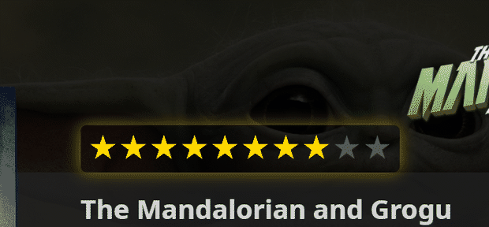

*Hovering the stars — the value a click would submit follows the pointer, and the popup lists who rated what*

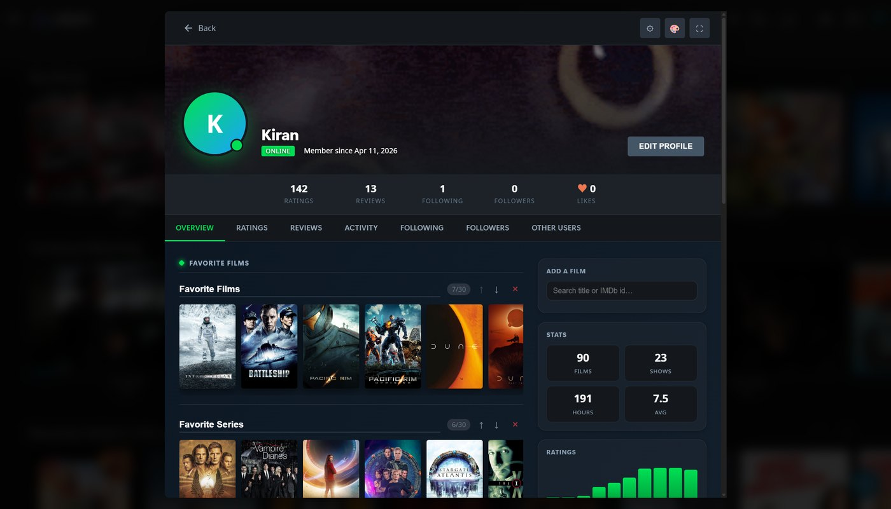

*A user profile: favourites, stats, rating distribution*

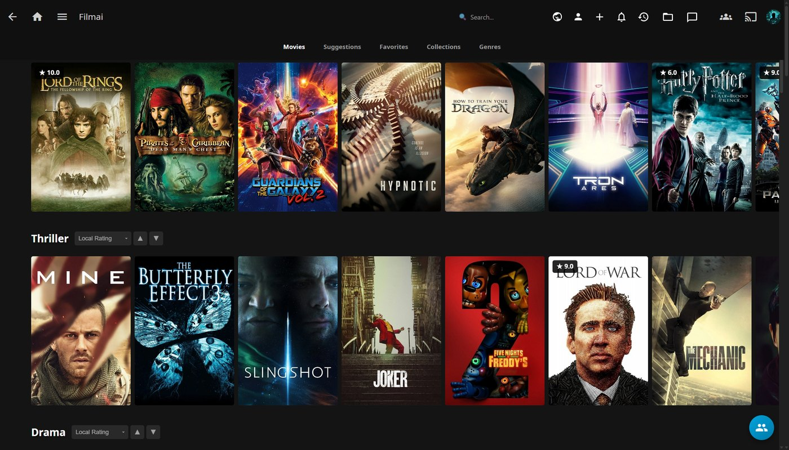

*Netflix-style browsing with per-genre rows and rating badges*

</div>

---

## Feature guide

### Star ratings

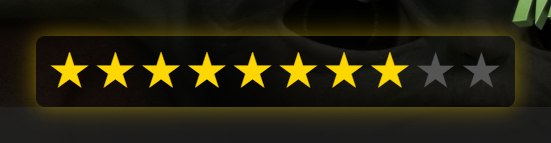

The core of the plugin. A star row is injected above the title on every detail page —
movies, series, seasons, episodes, music, anything Jellyfin can show.

- **1–10 stars per user.** The range is configurable (`MinRating` / `MaxRating`).
- **Three display modes** — ten stars, five stars, or five stars with half-star precision.
- **Quick mode or review mode.** With `QuickRatingMode` on, one click submits. With it off,
  clicking opens a modal where a written review can be added alongside the score.
- **Live hover preview.** Passing over a star shows the value it would submit as a small
  number on the star itself, so there is no guessing at the tenth position.
- **Edit or remove.** Re-rate at any time, or clear your rating entirely.
- **Rating stats line** — optional `8.0/10 - 12 ratings` text under the stars, with a
  configurable format string (`{avg}`, `{count}`, `{s}` for the plural suffix).

#### Written into Jellyfin's own fields

Ratings do not stay locked inside the plugin:

- **Per-user rating** is mirrored into Jellyfin's native `UserData.Rating`, so other tools —
  Maintainerr, scripts, other clients — can read it through the standard Jellyfin API.
  Non-destructive, and survives metadata refreshes. On by default.
- **Community rating** can optionally be overwritten with the plugin's average.
  ⚠️ This replaces the item's existing IMDb/TMDB score and is reverted whenever Jellyfin
  refreshes that item's metadata, so it is off by default.
- **One-time backfill** writes every existing rating into those native fields at once, for
  libraries that were rated before the option existed.

#### Who rated what


Hovering the widget lists every user's score for that item. It shows scores only — never
profile details — so it stays useful on a shared server without exposing anything.

---

### Written reviews

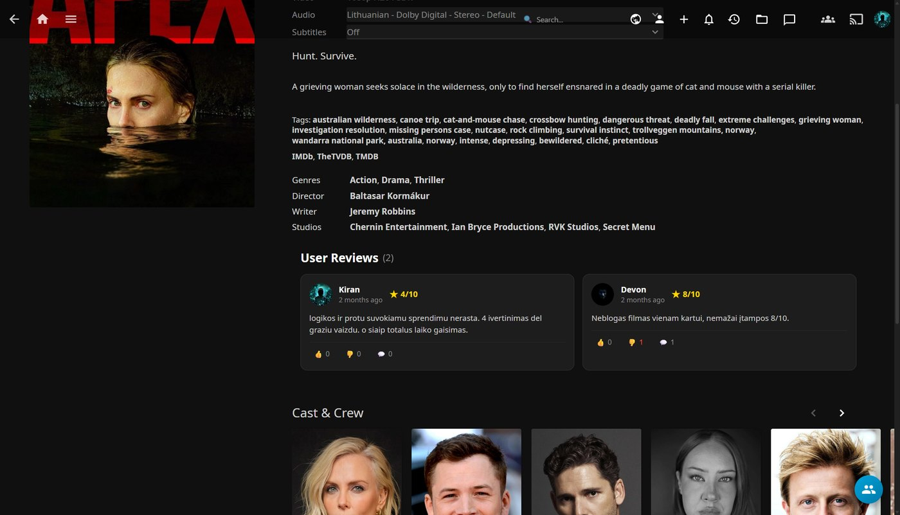

A **User Reviews** section is added to each detail page, below the metadata.

- Reviews are written together with a rating, from the rating modal.
- Each review card shows the author's avatar, name, age of the review and their score.
- **Likes and dislikes** on any review, with live counts.
- **Comments** — a threaded discussion per review, with deletion for the author and admins.
- **Featured reviews** can be pinned to your own profile.
- Reviews work on **catalog titles too** — items requested but not yet in the library.
- The whole review card is themable (14 separate colour and shape settings).

---

### Card rating badges

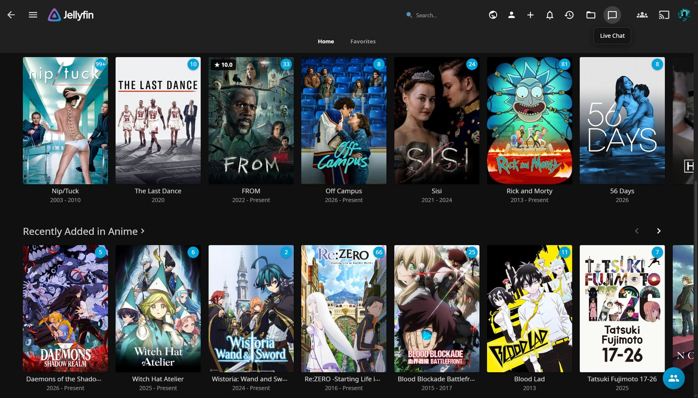

The average score appears as a small badge on poster cards everywhere in Jellyfin — home
rows, library grids, search results, collections.

- **Built for big libraries.** Badges load through an `IntersectionObserver`, so only cards
  actually on screen trigger a lookup, and lookups are batched into a single request.
- **Cached** per session, so scrolling back and forth costs nothing.
- **Badge display profiles** let you tune position, size, text visibility and background per
  screen-width range — a TV at 4K and a phone need different badge geometry, and this is
  where that gets set.
- Can be switched off entirely without disabling the detail-page widget.

---

### Netflix-style view


An alternative way to browse a movie library: horizontal rows grouped by genre instead of
one long alphabetical grid.

- One row per genre, each scrolling independently.
- **Per-row sorting** — sort any row by local rating, and flip the direction.
- **Row reordering** with up/down controls, so the genres you care about sit at the top.
- Rating badges carry over onto the cards.

---

### Search

A search field in the header, replacing a trip to Jellyfin's own search page.

- **Punctuation-insensitive** — `wall-e`, `wall e` and `walle` all find the same film.
- **Episode filtering** — optionally restrict results to movies and series so a search for a
  show does not bury you in 200 episodes.
- **Library-permission aware.** Results are filtered to the libraries each account is allowed
  to see, so a restricted user never discovers titles they cannot open.
- **External search** falls back to online metadata for titles not on the server, which is
  what feeds the request form and profile favourites.

---

### Latest media

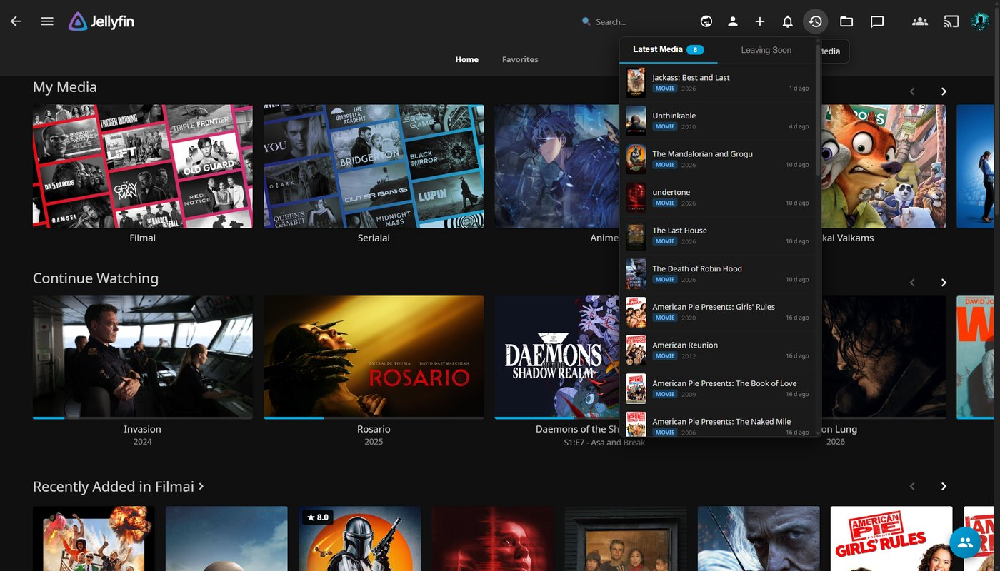

A header button (in place of Jellyfin's Sync Play button) opening a dropdown of the 50 most
recently added items, with a badge showing how many are new since you last looked.

---

### New media notifications

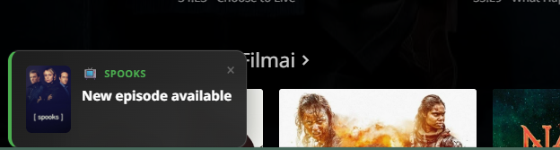

Popup notifications when something is added to the library.

- Poster, title and year in a compact card.
- **Episode grouping** — ten episodes added at once become a single *Episodes 4–8* notice
  instead of ten separate popups.
- **Randomised 2–10 minute delay** between notifications so a big import does not machine-gun
  everyone online.
- **24-hour duplicate suppression** per item.
- **Per-user toggle** via the bell icon; admins choose whether it defaults to on or off.
- Works **during playback**, including fullscreen.
- **Fire TV / Android TV** clients get them as native `DisplayMessage` notifications.

---

### Social profiles

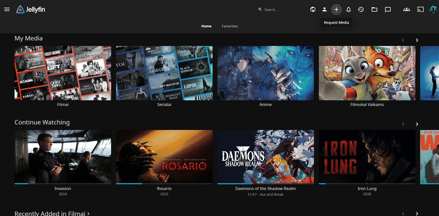

*From header button to profile, down through favourites, taste matching and the ratings tab*


Every user gets a profile page in the style of Letterboxd, reachable from the header or by
clicking any username.

**Header** — custom header media (image, GIF or video), avatar with a live online dot,
member-since date, and a stat row: ratings, reviews, following, followers, likes.

**Overview tab**

- **Favourite films and series** — up to 30 each, arranged by drag and drop, reordered with
  arrows, removable inline. Add anything by title or IMDb id, including titles not yet on the
  server.
- **Stats panel** — films watched, shows watched, total hours, average score.
- **Rating distribution** — a histogram of how you actually score things.
- **Recently rated** with the score under each poster.
- **Recent reviews** with posters and excerpts.

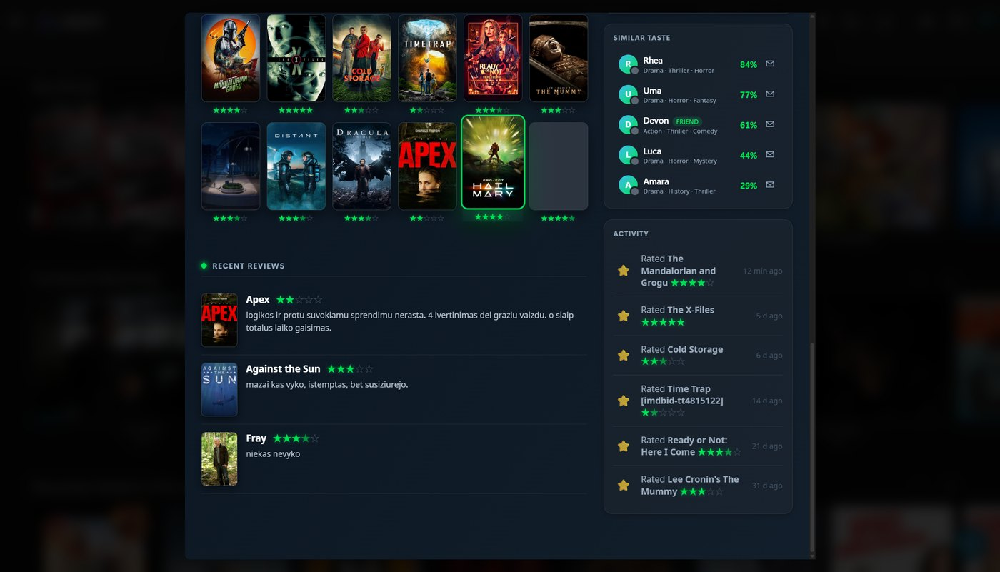

- **Similar taste** — other users ranked by how closely their ratings match yours, with a
  percentage, their top genres, a friend badge where applicable, and a shortcut to DM them.
- **Activity feed** — a chronological log of ratings, reviews and requests.

**Other tabs**

| Tab | Contents |
|---|---|
| **Ratings** | Everything you have rated, as a poster wall with scores |
| **Reviews** | Your full review history |
| **Activity** | The complete activity log |
| **Following / Followers** | Who you follow and who follows you |
| **Other Users** | Everyone on the server, filterable, with friend badges |

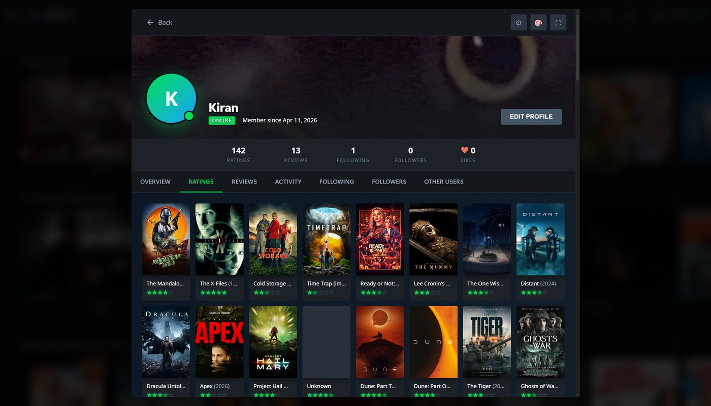

*The Ratings tab — everything you have scored, with the score under each poster*

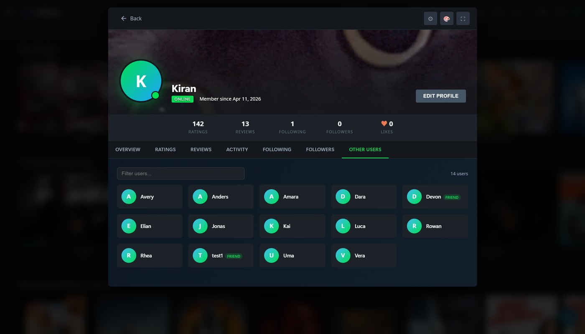

**Personalisation** — a style editor (palette icon) for your own profile colours, a settings
panel for privacy, and a fullscreen toggle.

---

### Friends, follows, likes and blocks

Four separate relationships, deliberately kept distinct:

- **Friend requests** — mutual, with incoming/outgoing queues, accept, reject and cancel.
- **Following** — one-directional, no approval needed.
- **Profile likes** — a lightweight appreciation signal, counted on the profile header.
- **Blocking** — hides you from another user across chat, profiles and activity.

A floating friends button gives quick access to who is online.

---

### Custom lists

Build your own collections — "Best of 2026", "Comfort rewatches", anything.

- Create, rename and delete lists.
- Add and remove items, reorder them by hand.
- **Clone** somebody else's list into your own account.
- Lists appear on your profile for others to browse.

---

### Live presence and now watching

- **Heartbeat-driven online status**, shown as a dot on avatars everywhere.
- **Now watching** — what each user is playing right now, with a poster and a hover card
  showing details.
- **Custom status** text.
- **Privacy settings** with one-click presets, so a user can go fully invisible without
  hunting through toggles.

Presence is delivered over a **WebSocket** connection, so it updates live rather than polling.

---

### Live chat and direct messages

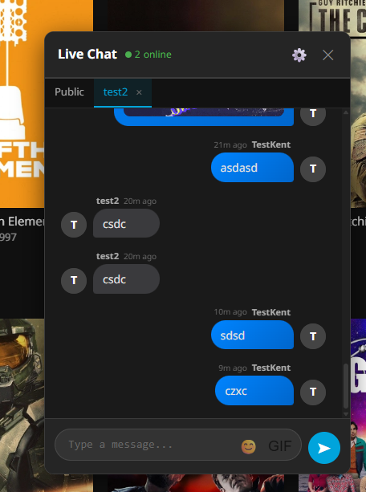 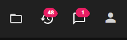

A chat window docked in the corner of the Jellyfin UI.

- **Public room** for everyone on the server.
- **Direct messages** — private one-to-one conversations, each in its own tab, with unread
  badges and a conversation list.
- **Emoji picker** and **GIF search** (via Klipy, with legacy Tenor support).
- **Typing indicators** and a live online count.
- **Unread badges** on the header button, separately for public and private.
- **Notifications** for new messages, individually switchable for public and private.
- **Rate limiting** (default 10 messages/minute), **message length cap** (default 500) and
  **automatic retention cleanup** (default 7 days).

---

### Moderator system

Chat moderation without handing out admin accounts. Three tiers, each with its own ceiling:

| Level | Can do | Bounded by |
|---|---|---|
| **1** | Delete messages, snooze users | Daily delete limit, fixed snooze duration |
| **2** | Everything above, plus temporary bans | Daily delete limit, maximum ban length in days |
| **3** | Everything above, plus media bans | Maximum media-ban days per user per month |

- Every moderator action is **logged and reviewable**, with per-moderator statistics.
- **Rate limiting** on moderator actions.
- Moderators can be promoted and demoted between levels.
- Admins can grant **custom name styles** and **message quotas** to individual users.

---

### Media requests

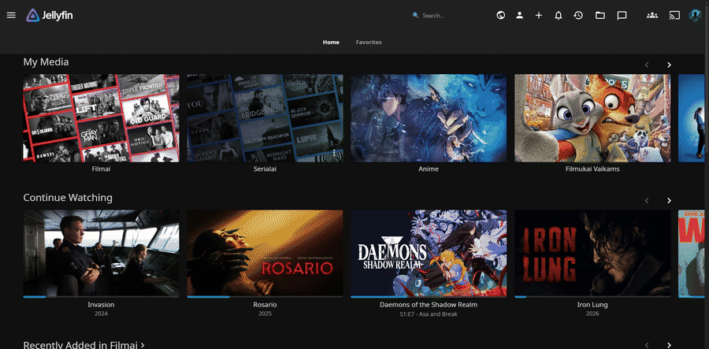

*Pressing the header button, and the dialog stepping through its three tabs*

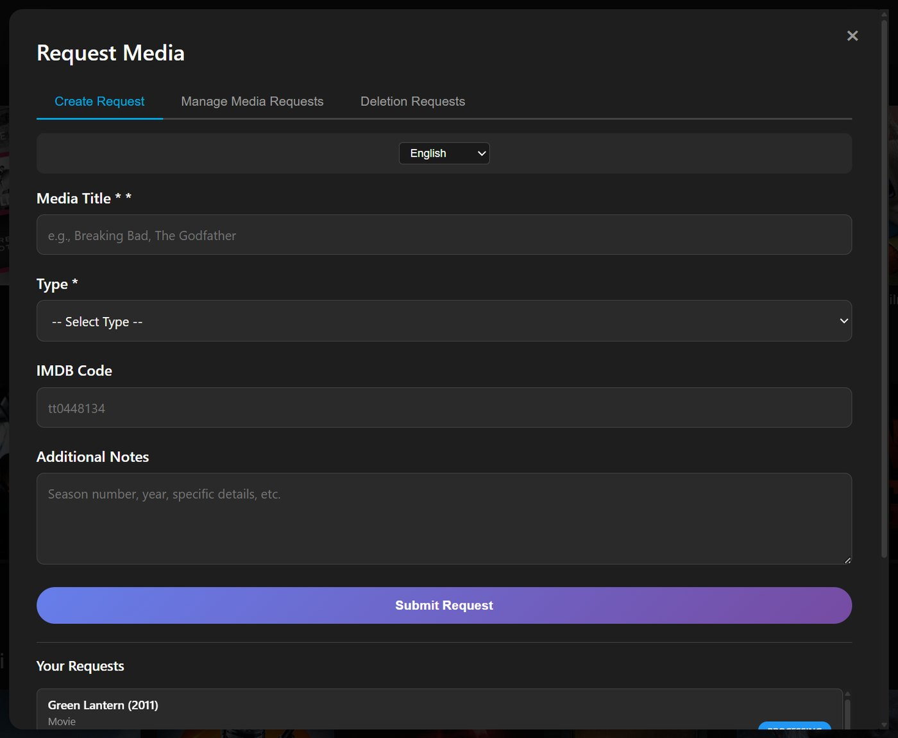

A request workflow so users can ask for content without messaging you directly.

**For users**

- Request form opened from the header button.
- Fields: title, type (Movie / TV Series / Anime), notes, IMDb code, IMDb link — plus any
  **custom fields** you define.
- **Every field is configurable**: shown or hidden, required or optional, with your own
  labels and placeholder text. The window title, description and submit button text can all
  be rewritten too.
- Track your own requests and their status, with timestamps.
- A **Watch Now** button appears when a request is fulfilled, linking to the item.
- Optional **monthly request quota** per user.

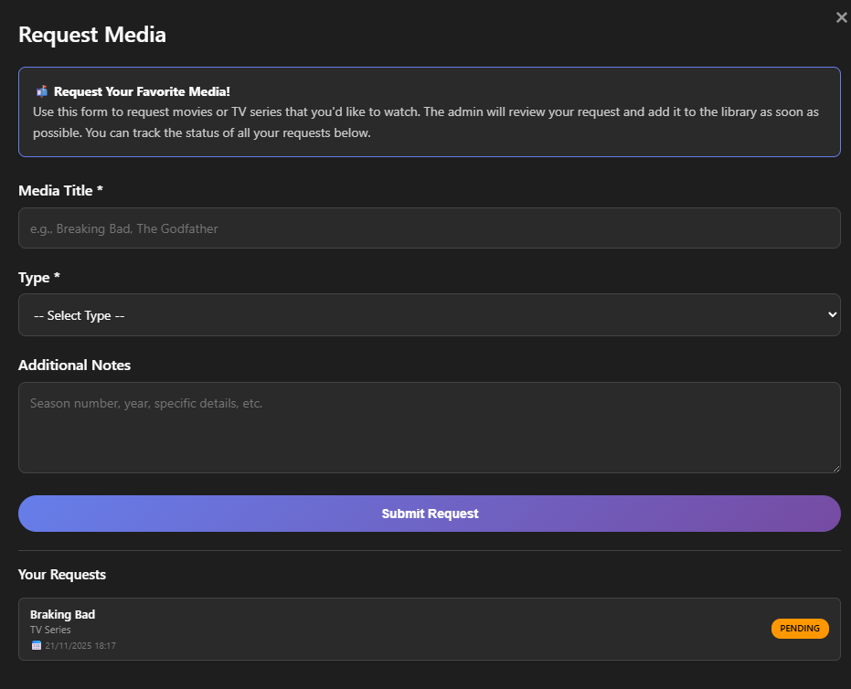 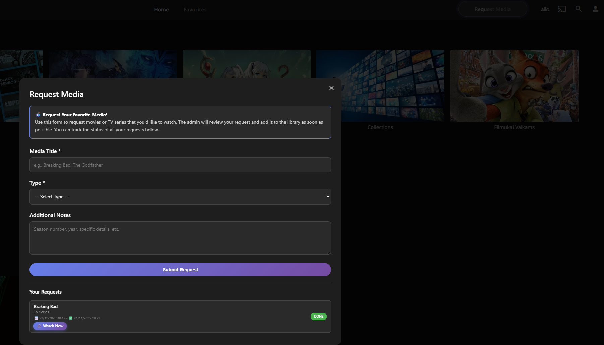

*Left: a request working through the queue. Right: the Watch Now button once it lands.*

**For admins**

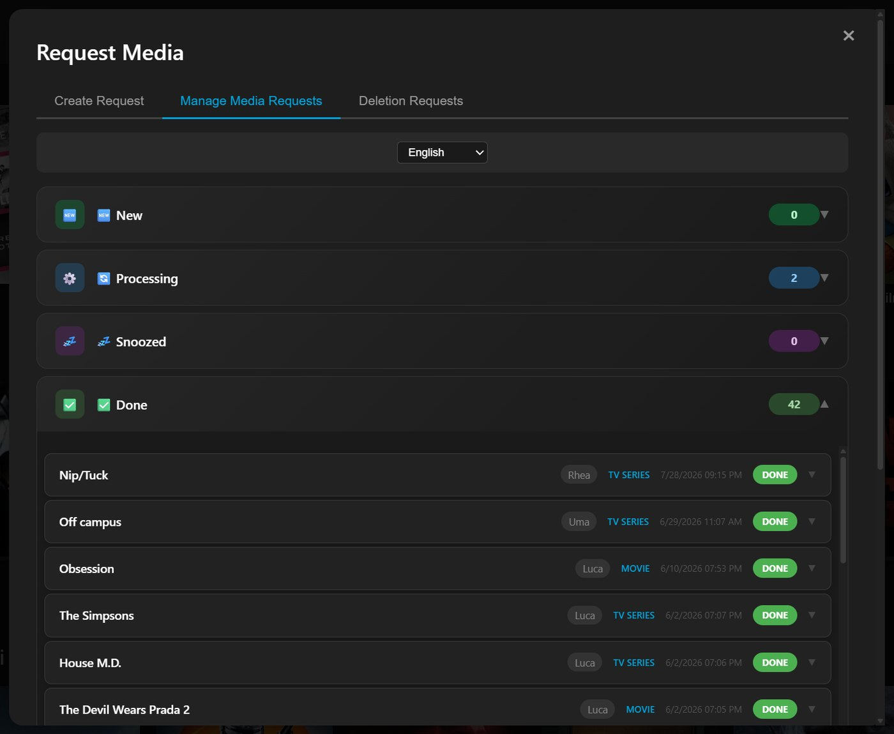

- Requests grouped into **New, Processing, Snoozed, Done and Rejected**, each with a live count.
- One-click status changes; add a media link when marking something done.
- **Snooze** a request until a chosen date — useful for "not released yet".
- **Rejection reasons** shown back to the requester.
- **Auto-delete** rejected requests after a set number of days.
- A header badge shows how many requests are waiting.
- Admins can optionally submit requests themselves, like any other user.

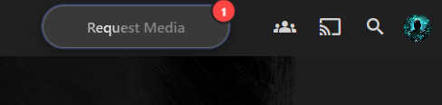

*The pending-request count, shown on the header button*

---

### Deletion requests

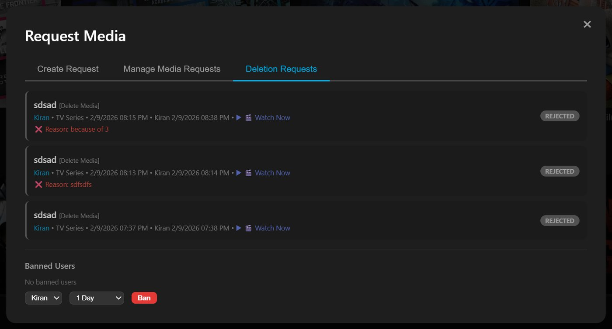

The other direction: users nominating things for removal to free up space.

- Users request deletion from the item page, with a reason.
- **Three requests per item per user**, to stop one person spamming the queue.
- Admins approve or reject, with a rejection reason shown back to the user.
- Approved requests feed into the scheduled deletion system below.

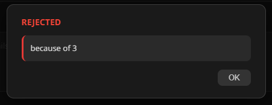 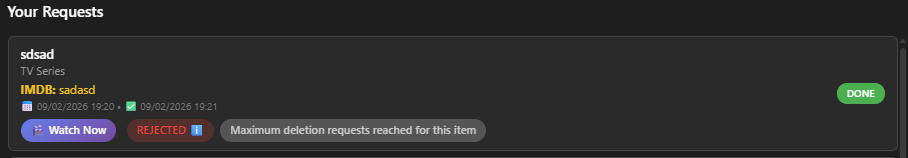

*Left: writing the rejection reason. Right: what a user sees once they hit the three-request limit.*

---

### User bans

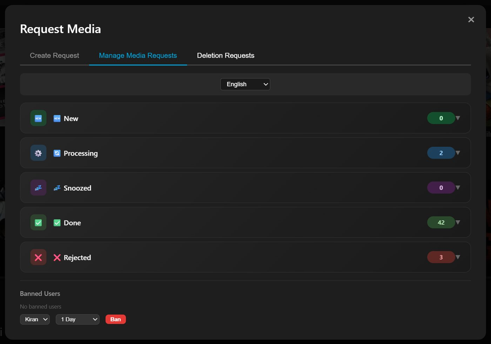

Time-limited bans, applied **per request type** — someone can lose media-request rights while
keeping deletion-request rights, or the reverse. Durations run from a day upwards, and active
bans are listed with the option to lift them early.

---

### Media management

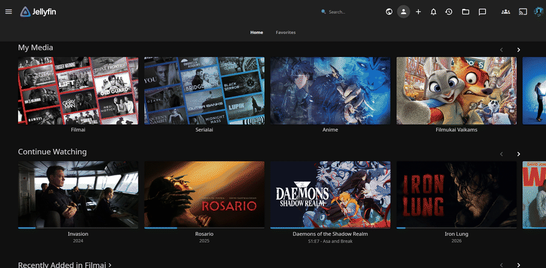

*Scheduled deletions, disk usage and the duplicate finder, in one dialog*

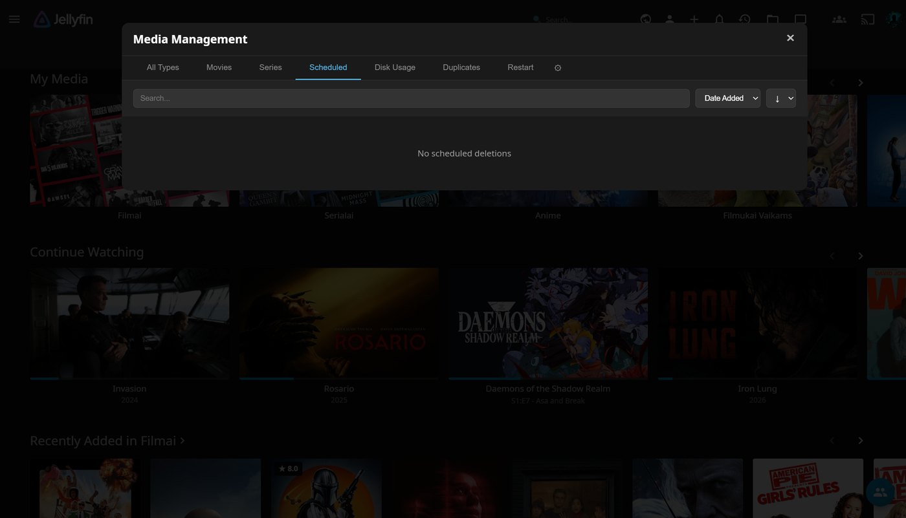

An admin toolbox for keeping a large server healthy, opened from the header.

**Scheduled deletion**

- Schedule any item for deletion after a delay (7 days by default).
- Scheduled items show a **"leaving soon"** badge to users.
- Users can **ask to keep** an item; once enough people ask, the deletion
  **auto-cancels** — the threshold is configurable, or the feature can be turned off.
- Filter the browse list by library type, and by movies or series.

**Disk usage**

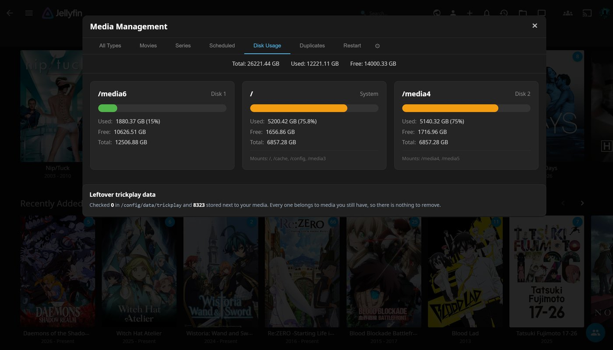

Per-mount capacity with used/free/total and a fill bar, plus the combined totals.

**Leftover trickplay cleanup**

Trickplay tiles left behind by deleted media, in both places Jellyfin can store them: the
central `trickplay` directory *and* the `.trickplay` folders saved next to each video when a
library uses that setting. The panel reports exactly what it scanned and where, so "nothing
to clean up" can be told apart from a scan that never ran.

**Duplicate finder**

Finds items that exist more than once in the library and offers direct deletion.

**Scheduled restart**

Schedule a server restart with a countdown, cancellable while it is pending.

---

### Admin dashboard

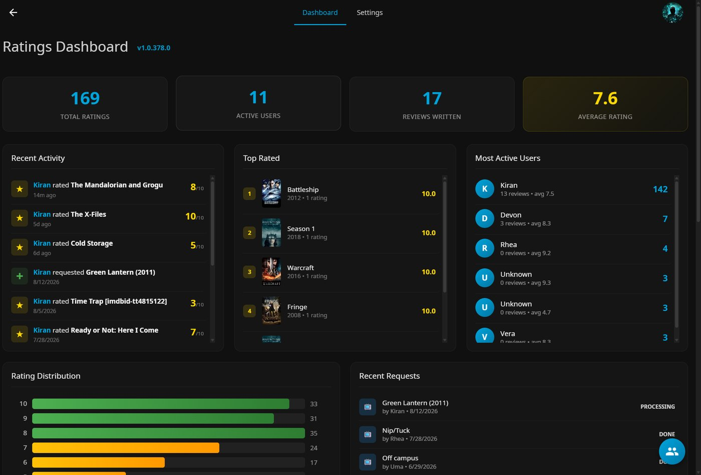

A dedicated page in the Jellyfin dashboard sidebar:

- **Headline numbers** — total ratings, active users, reviews written, server-wide average.
- **Recent activity** across all users.
- **Top rated** titles with posters.
- **Most active users** leaderboard, with each user's review count and average score.
- **Rating distribution** histogram for the whole server.
- **Recent requests** with status.

---

### Backup and restore

Export every piece of plugin data — ratings, reviews, requests, lists, profiles, chat history —
as a single file, and import it back. The settings page tracks the date of your last backup and
reminds you when it has been a while.

---

### Integrations

- **TMDB** — poster fallback for items Jellyfin could not identify, plus a language setting so
  titles and descriptions come back in the language you actually want.
- **IMDb** — optional IMDb sorting in the library sort dropdown, and IMDb ids stored against
  items for matching requests and favourites.

---

### Theming

Roughly 60 settings dedicated purely to appearance, split into three groups on the settings page.

<details>
<summary><b>Star widget</b> — background, border, radius, glow, colours, custom CSS</summary>

<br>

| Setting | Purpose |
|---|---|
| `StarWidgetBackground` | Widget background, rgba supported |
| `StarWidgetBorderEnabled` / `StarWidgetBorderColor` / `StarWidgetBorderRadius` | Border on/off, colour, corner radius |
| `StarWidgetGlowEffect` / `StarWidgetGlowColor` | Outer glow and its colour |
| `StarFilledColor` / `StarEmptyColor` / `StarHoverColor` | The three star states |
| `StarWidgetCustomCSS` | Free-form CSS for animations and anything not covered above |

</details>

<details>
<summary><b>Header button group</b> — the plugin's toolbar in the Jellyfin header</summary>

<br>

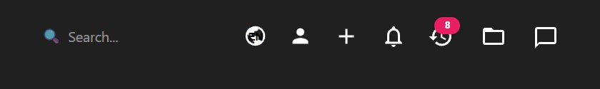

Background (or fully transparent), border colour and radius, icon colour and opacity, hover
background, glow effect, overall group opacity, and separate control over the search field's
background so it can match the group or stand apart.

</details>

<details>
<summary><b>Review cards</b> — 14 settings covering every element of a review</summary>

<br>

Background and hover background, border on/off, colour and radius, username colour, timestamp
colour, body text colour, rating colour, action-button colour and hover colour, liked and
disliked colours, overall opacity, and whether hovering a reviewer shows a profile tooltip.

</details>

<details>
<summary><b>Badge display profiles</b> — per-resolution badge geometry</summary>

<br>

A JSON list of profiles, each matching a screen-width range:

```json
[{ "minWidth": 0, "maxWidth": 1920, "offsetX": 0, "offsetY": 0,
   "hideText": false, "sizePercent": 0, "removeBackground": false }]
```

The first profile whose range contains the current viewport width wins, so a phone, a laptop
and a 4K television can each get badge placement that suits them.

</details>

---

### Languages

The entire interface ships in **16 languages**:

English · Español · 中文 · Português · Русский · 日本語 · Deutsch · Français · 한국어 ·
Italiano · Türkçe · Polski · Nederlands · العربية · हिन्दी · Lietuvių

Admins pick the server default; each user can override it from the header, and the choice
persists in their browser. Language packs are served as separate, pre-compressed files so
adding languages does not grow the main bundle.

---

## Configuration

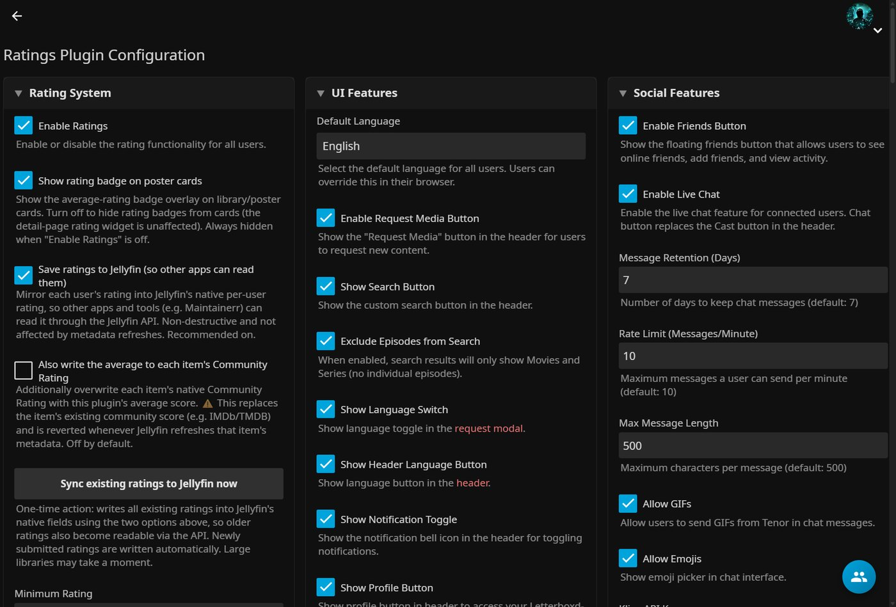

Everything is configured from **Dashboard → Plugins → Ratings → Settings**. Each option carries
its own explanation on the page itself; the sections are:

Rating System · UI Features · Social Features · Star Widget Styling · Badge Display Profiles ·
Header Button Group Styling · User Reviews Card Styling · Request Form (window, title, type,
notes, IMDb code and IMDb link fields) · Custom Fields · Chat Notification Badge · Moderator System

### Configuration reference

<details>
<summary><b>Rating system</b></summary>

<br>

| Setting | Default | Description |
|---|---|---|
| `EnableRatings` | `true` | Master switch for the whole rating feature |
| `ShowCardRatingOverlay` | `true` | Average-score badge on poster cards |
| `WriteRatingsToJellyfin` | `true` | Mirror each rating into Jellyfin's native per-user rating |
| `WriteAverageToCommunityRating` | `false` | Overwrite the item's community score with the plugin average ⚠️ |
| `MinRating` / `MaxRating` | `1` / `10` | Rating range |
| `StarDisplayMode` | `10-stars` | `10-stars`, `5-stars-half`, or `5-stars` |
| `QuickRatingMode` | `false` | Submit on click instead of opening the review modal |
| `ShowRatingStats` / `RatingStatsFormat` | `false` / `{avg}/10 - {count} rating{s}` | Stats line under the stars |
| `ShowYourRating` / `YourRatingFormat` | `false` / — | "Your rating" line and its format |
| `EnableImdbSorting` | `true` | Add IMDb sorting to the library sort dropdown |

</details>

<details>
<summary><b>UI features</b></summary>

<br>

| Setting | Default | Description |
|---|---|---|
| `DefaultLanguage` | `en` | Server default UI language |
| `EnableNetflixView` | `true` | Genre-row browsing on movie pages |
| `EnableRequestButton` | `true` | Request Media button in the header |
| `ShowSearchButton` / `SearchExcludeEpisodes` | `true` / `true` | Header search, and whether episodes are excluded |
| `ShowLanguageSwitch` / `ShowHeaderLanguageButton` | `true` / `true` | Language switch in the request modal / header |
| `ShowNotificationToggle` / `NotificationsEnabledByDefault` | `true` / `true` | Bell icon, and its default state |
| `ShowLatestMediaButton` | `true` | Latest Media dropdown in the header |
| `ShowHeaderProfileButton` | `true` | Profile button in the header |
| `HideHomeDuplicates` | `true` | Suppress duplicate cards on the home page |
| `EnableNewMediaNotifications` / `EnableEpisodeGrouping` | `true` / `true` | New-media popups, and episode grouping |

</details>

<details>
<summary><b>Social and chat</b></summary>

<br>

| Setting | Default | Description |
|---|---|---|
| `EnableFriendsButton` | `true` | Floating friends button |
| `EnableChat` | `true` | Live chat and DMs |
| `ChatMessageRetentionDays` | `7` | How long messages are kept |
| `ChatRateLimitPerMinute` | `10` | Messages per user per minute |
| `ChatMaxMessageLength` | `500` | Characters per message |
| `ChatAllowGifs` / `ChatAllowEmojis` | `true` / `true` | GIF and emoji support |
| `KlipyApiKey` / `TenorApiKey` | — | GIF search provider key (Klipy is current, Tenor is legacy) |
| `ChatNotifyPublic` / `ChatNotifyPrivate` | `true` / `true` | Notifications per message type |
| `ModLevel1DeleteLimit`, `ModLevel1SnoozeMinutes` | — | Level 1 moderator ceilings |
| `ModLevel2DeleteLimit`, `ModLevel2TempBanMaxDays` | — | Level 2 moderator ceilings |
| `ModLevel3MediaBanMaxDays` | — | Level 3 media-ban ceiling |
| `ModeratorActionRateLimitPerMinute` | — | Rate limit on moderator actions |

</details>

<details>
<summary><b>Requests and media management</b></summary>

<br>

| Setting | Default | Description |
|---|---|---|
| `MaxRequestsPerMonth` | `0` (unlimited) | Per-user monthly request quota |
| `AutoDeleteRejectedDays` | `0` (off) | Auto-remove rejected requests after N days |
| `EnableAdminRequests` | `true` | Let admins submit requests like users |
| `CustomRequestFields` | — | Extra form fields, as JSON |
| `Request*Enabled` / `Request*Required` / `Request*Label` / `Request*Placeholder` | — | Per-field control for title, type, notes, IMDb code and IMDb link |
| `RequestWindowTitle` / `RequestWindowDescription` / `RequestSubmitButtonText` | — | Rewrite the modal's own wording |
| `EnableMediaManagement` | `true` | Admin media tools |
| `DefaultDeletionDelayDays` | `7` | Delay before a scheduled deletion runs |
| `AutoCancelDeletionThreshold` | — | "Keep" requests needed to cancel a deletion (`0` disables) |

</details>

<details>
<summary><b>External services</b></summary>

<br>

| Setting | Description |
|---|---|
| `TmdbApiToken` | TMDB v4 read access token, for poster fallback |
| `EnableExternalPosterFallback` | Show a TMDB poster when Jellyfin has none |
| `TmdbLanguage` | Language for TMDB titles and descriptions (e.g. `en-US`) |

</details>

---

## Installation

1. **Add the plugin repository**

   Dashboard → Plugins → Repositories → add:

   ```
   https://raw.githubusercontent.com/K3ntas/jellyfin-plugin-ratings/main/manifest.json
   ```

2. **Install**

   Plugins → Catalog → find **Ratings** → Install → restart Jellyfin.

3. **That's it**

   The rating widget, header buttons and notification toggle appear automatically. Nothing
   needs configuring to get started — the defaults are sensible, and every feature can be
   tuned afterwards from the settings page.

---

## Usage

**Rating something** — open any item, find the stars above the title, click. With quick mode
off you get a modal where you can add a review; with it on the click is the rating.

**Seeing who rated what** — hover the star widget on a detail page.

**Reviewing** — write it in the rating modal, or edit it later from your profile's Reviews tab.
Reviews appear under the item for everyone, and can be liked and commented on.

**Requesting media** — click the request button in the header, fill in the form, watch its
status change from New through Processing to Done. A Watch Now button appears when it lands.

**Requesting a deletion** — from the item page. An admin approves or rejects it, and you see
the reason either way.

**Your profile** — the person icon in the header. Add favourites by dragging or by searching
any title, set your header media, and browse other users through the Other Users tab.

**Chatting** — the speech-bubble icon. The Public tab is the shared room; clicking a user
anywhere opens a private tab with them.

**Admin work** — the folder icon opens Media Management, the request button opens the request
queue with its ban controls, and the Ratings Dashboard lives in the Jellyfin sidebar.

---

## Technical details

### Requirements

- **Jellyfin** 10.11.0 or newer
- **.NET** 9.0
- A modern browser with JavaScript enabled

### Architecture

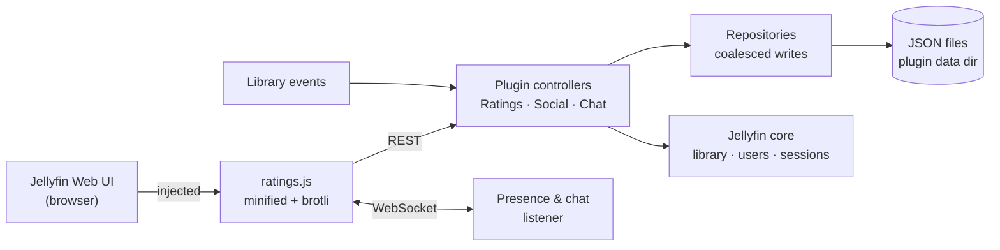
```mermaid
flowchart LR
    B["Jellyfin Web UI<br/>(browser)"] -->|injected| JS["ratings.js<br/>minified + brotli"]
    JS -->|REST| API["Plugin controllers<br/>Ratings · Social · Chat"]
    JS <-->|WebSocket| WS["Presence &amp; chat<br/>listener"]
    API --> REPO["Repositories<br/>coalesced writes"]
    REPO --> JSONF[("JSON files<br/>plugin data dir")]
    API --> JF["Jellyfin core<br/>library · users · sessions"]
    NS["Library events"] --> API
```

- **Backend** — ASP.NET Core controllers inside the plugin, using Jellyfin's own
  authentication. 181 endpoints across three controllers.
- **Frontend** — a single vanilla-JavaScript bundle with no dependencies, injected into the
  web client. Minified at build time and shipped with pre-built Brotli and gzip copies, since
  Jellyfin does not compress plugin assets for direct-HTTPS clients.
- **Storage** — JSON files in the plugin data directory, with coalesced writes so bursts of
  activity do not hammer the disk.
- **Live updates** — a WebSocket listener drives presence, "now watching" and chat.
- **Permissions** — every query is filtered by the libraries each account may see, and every
  endpoint authenticates.

### Performance

- Card badges load through an `IntersectionObserver` and are fetched in batches.
- CSS and translations are served separately from the main bundle and cached by the browser.
- Assets ship pre-compressed; the server picks the right encoding per request.
- Admin media lists are paginated.
- Only errors are logged, not routine operations.

### API reference

<details>
<summary><b>Ratings, reviews and search</b> — 65 endpoints</summary>

<br>

| Method | Route | Purpose |
|---|---|---|
| `POST` | `/Ratings/Items/{itemId}/Rating` | Submit or update a rating |
| `DELETE` | `/Ratings/Items/{itemId}/Rating` | Remove your rating |
| `GET` | `/Ratings/Items/{itemId}/Stats` | Average and count for an item |
| `GET` | `/Ratings/Items/BatchStats` | Stats for many items at once |
| `GET` | `/Ratings/Items/{itemId}/UserRating` | Your rating for an item |
| `GET` | `/Ratings/Items/{itemId}/DetailedRatings` | Every user's rating |
| `PUT` | `/Ratings/Items/{itemId}/Review` | Write or edit a review |
| `POST` | `/Ratings/Reviews/{userId}/{itemId}/Like` | Like or dislike a review |
| `GET` `POST` | `/Ratings/Reviews/{userId}/{itemId}/Comments` | Read and post comments |
| `GET` | `/Ratings/Search` · `/Ratings/ExternalSearch` | Library and external search |
| `GET` | `/Ratings/SortedLibrary` · `/Ratings/LatestMedia` | Sorted browsing and latest items |
| `GET` | `/Ratings/Stats` · `/TopRated` · `/MostActiveUsers` · `/RatingDistribution` | Dashboard data |

</details>

<details>
<summary><b>Requests, deletions, bans and admin tools</b></summary>

<br>

| Method | Route | Purpose |
|---|---|---|
| `GET` `POST` | `/Ratings/Requests` | List and create media requests |
| `POST` | `/Ratings/Requests/{id}/Status` · `/Snooze` · `/Unsnooze` | Request workflow |
| `GET` `POST` | `/Ratings/DeletionRequests` | Deletion request queue |
| `GET` `POST` `DELETE` | `/Ratings/Bans` | Ban management |
| `GET` `POST` | `/Ratings/Media` · `/Media/{id}/ScheduleDeletion` | Scheduled deletion |
| `POST` | `/Ratings/KeepRequest/{itemId}` | Ask to keep an item |
| `GET` | `/Ratings/Admin/DiskUsage` · `/Admin/Duplicates` | Disk and duplicate tools |
| `GET` `POST` | `/Ratings/Admin/OrphanedTrickplay` | Trickplay scan and cleanup |
| `POST` `DELETE` | `/Ratings/Admin/ScheduleRestart` | Scheduled restarts |
| `GET` `POST` | `/Ratings/Backup/Export` · `/Backup/Import` | Backup and restore |

</details>

<details>
<summary><b>Social</b> — 79 endpoints</summary>

<br>

Profiles (`/Social/Profile/{userId}` and its `Full`, `Stats`, `Ratings`, `Reviews`, `Activity`,
`Genres`, `SimilarUsers`, `Lists`, `Followers`, `Following`, `FeaturedReviews` variants),
friend requests, follows, profile likes, blocks, custom lists with reordering and cloning,
header media, profile styling, notifications, presence (`Heartbeat`, `Watching`, `OnlineStatus`),
privacy settings and presets, and IMDb id storage.

</details>

<details>
<summary><b>Chat</b> — 37 endpoints</summary>

<br>

Public messages, direct messages and conversations, unread counts, typing indicators, online
users, GIF search, moderator management with levels and statistics, action logs, bans, per-user
styles and message quotas.

</details>

---

## Development

```bash
git clone https://github.com/K3ntas/jellyfin-plugin-ratings.git
cd jellyfin-plugin-ratings
dotnet build -c Release -p:RequireMinification=true
```

`RequireMinification=true` turns a missing Node/esbuild into a hard error rather than silently
shipping the unminified bundle. Continuous integration builds every push to `main` and `dev`,
verifies that minification actually ran, syntax-checks the JavaScript and validates the manifest.

### Project structure

```
├── Api/                       # Controllers
│   ├── RatingsController.cs       ratings, reviews, requests, admin tools
│   ├── SocialController.cs        profiles, friends, lists, presence
│   ├── ChatController.cs          public chat, DMs, moderation
│   └── SocialWebSocketListener.cs live presence and chat push
├── Data/                      # JSON-backed repositories
├── Models/                    # DTOs and stored entities
├── Web/
│   ├── ratings.js                 client bundle
│   ├── ratings.css                stylesheet
│   └── i18n/                      16 language packs
├── Configuration/             # Settings page + PluginConfiguration
├── Pages/                     # Dashboard pages
├── tools/compress-assets.js   # Brotli + gzip generation
├── docs/                      # Developer documentation
└── manifest.json              # Plugin catalog manifest
```

### Contributing

Issues and pull requests are welcome — see the
[issue tracker](https://github.com/K3ntas/jellyfin-plugin-ratings/issues).
Security reports are covered by [SECURITY.md](SECURITY.md).

---

## Version history

Release notes for every version live on the
**[Releases page](https://github.com/K3ntas/jellyfin-plugin-ratings/releases)**, and the plugin
catalog reads the same changelogs from `manifest.json`.

---

> **A note on the screenshots.** They are taken from a live server. Usernames shown are
> pseudonyms; the library titles are genuine.

---

## License

MIT — see [LICENSE](LICENSE).

## Acknowledgments

Built for the Jellyfin community. Thanks to everyone who has reported bugs, suggested features
and contributed fixes.

<div align="center">
<sub>If this plugin is useful to you, a ⭐ on the repository helps others find it.</sub>
</div>
